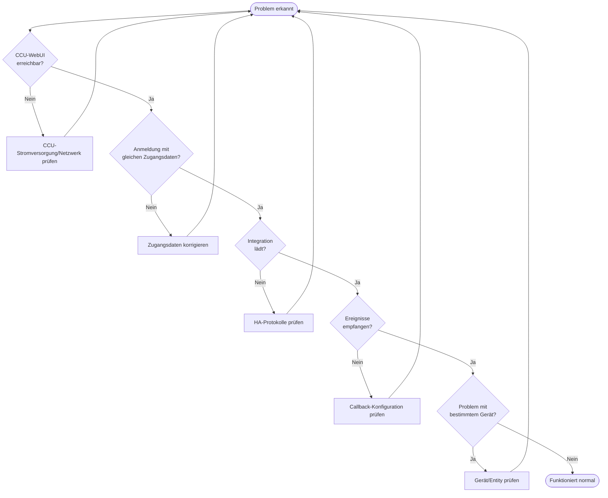

# Fehlerbehebung

Dieser Abschnitt hilft bei der Diagnose und Behebung häufiger Probleme mit aiohomematic und der Homematic(IP) Local-Integration.

## Schnell-Diagnose-Flussdiagramm



## Schnell-Diagnose-Checkliste

Vor der Untersuchung spezifischer Probleme diese Grundlagen überprüfen:

| Prüfung                  | Vorgehensweise                 | Erwartetes Ergebnis                  |
| ------------------------ | ------------------------------ | ------------------------------------ |
| **CCU erreichbar**       | CCU-WebUI im Browser öffnen    | WebUI wird geladen                   |
| **Zugangsdaten gültig**  | Am CCU-WebUI anmelden          | Anmeldung erfolgreich                |
| **Netzwerk-Ports offen** | `telnet ccu-ip 2010`           | Verbindung hergestellt               |
| **HA-Protokolle sauber** | Settings → System → Logs       | Keine Fehler von `homematicip_local` |
| **Administratorrechte**  | CCU → Einstellungen → Benutzer | Benutzer hat Administratorrolle      |

## Häufige Probleme nach Kategorie

### Verbindungsprobleme

- [CCU nicht erreichbar](#ccu-nicht-erreichbar)
- [Authentifizierungsfehler](#authentifizierungsfehler)
- [Callback-/Ereignis-Probleme](#callback-probleme)
- [Docker-Netzwerk](#docker-netzwerk)

### Geräteprobleme

- [Gerät erscheint nicht](#gerät-erscheint-nicht)
- [Entity zeigt "nicht verfügbar"](#entity-nicht-verfügbar)
- [Werte aktualisieren sich nicht](#werte-aktualisieren-sich-nicht)
- [Tastenereignisse funktionieren nicht](#tastenereignisse-funktionieren-nicht)
- [Fehlende Parameter nach Firmware-Update](paramset_inconsistency.md)

### Leistungsprobleme

- [Langsamer Start](#langsamer-start)
- [Hohe CPU-Auslastung](#hohe-cpu-auslastung)
- [Häufige Verbindungsabbrüche](#häufige-verbindungsabbrüche)

---

## Verbindungsprobleme

### CCU nicht erreichbar

**Symptome:**

- Integration startet nicht
- „Connection refused"- oder „Timeout"-Fehler in den Protokollen

**Lösungen:**

1. CCU-IP-Adresse auf Korrektheit prüfen
2. Sicherstellen, dass die CCU eingeschaltet und vollständig gestartet ist
3. Konnektivität testen: `ping ihre-ccu-ip`
4. Überprüfen, ob die Firewall die erforderlichen Ports zulässt (siehe [Port-Referenz](#port-referenz))

### Authentifizierungsfehler

**Symptome:**

- „Authentication failed"-Fehler
- „Invalid credentials" in den Protokollen

**Lösungen:**

1. Benutzernamen exakt wie in der CCU angezeigt überprüfen (Groß-/Kleinschreibung beachten)
2. Sicherstellen, dass das Passwort nur erlaubte Zeichen enthält: `A-Z`, `a-z`, `0-9`, `.!$():;#-`
3. Sicherstellen, dass der Benutzer Administratorrechte in der CCU hat
4. Versuch, sich mit denselben Zugangsdaten am CCU-WebUI anzumelden

### Callback-Probleme

**Symptome:**

- Geräte erscheinen, aber Werte aktualisieren sich nicht
- „No events received"-Warnungen
- Zustandsänderungen in der CCU werden nicht in HA widergespiegelt

**Lösungen:**

1. Sicherstellen, dass die CCU Home Assistant erreichen kann (Firewall prüfen)
2. Bei Docker: `callback_host` auf die Docker-Host-IP setzen
3. Prüfen, ob `callback_port_xml_rpc` nicht blockiert ist
4. Sicherstellen, dass keine andere Integration denselben Callback-Port verwendet

### Docker-Netzwerk

**Symptome:**

- Integration funktioniert anfänglich, verliert aber die Verbindung
- Ereignisse werden in Docker-Umgebungen nicht empfangen

**Lösungen:**

| Setup                      | Empfehlung                                                           |
| -------------------------- | -------------------------------------------------------------------- |
| Docker mit Bridge-Netzwerk | `callback_host` auf Host-IP setzen, Port-Weiterleitung konfigurieren |
| Docker mit Host-Netzwerk   | `network_mode: host` verwenden (empfohlen)                           |
| Home Assistant OS          | Sollte ohne weitere Konfiguration funktionieren                      |

---

## Geräteprobleme

### Gerät erscheint nicht

**Symptome:**

- Gekoppeltes Gerät in der CCU, aber nicht in HA
- Gerät in der CCU sichtbar, aber in HA-Geräten fehlend

**Lösungen:**

1. **Settings → System → Repairs** auf ausstehende Gerätebenachrichtigungen prüfen
2. Integration neu laden (Settings → Devices & Services → Reload)
3. Sicherstellen, dass das Gerät in der CCU gekoppelt ist und als online angezeigt wird
4. Prüfen, ob die richtige Schnittstelle aktiviert ist (HmIP-RF, BidCos-RF usw.)

### Entity nicht verfügbar

**Symptome:**

- Entity zeigt den Zustand „nicht verfügbar"
- Graue Entity-Karte im Dashboard

**Lösungen:**

1. Entity ist möglicherweise standardmäßig deaktiviert → In den Entity-Einstellungen aktivieren
2. Gerätebatterie bei Funkgeräten prüfen
3. Sicherstellen, dass das Gerät in Reichweite der CCU ist
4. RSSI-Werte prüfen (siehe [RSSI-Fix](../user/troubleshooting/rssi_fix.md))

### Werte aktualisieren sich nicht

**Symptome:**

- Entity-Wert ändert sich nicht, wenn sich der Gerätezustand ändert
- Manuelle Aktualisierung erforderlich, um Updates zu sehen

**Lösungen:**

1. Callback-Konfiguration prüfen (siehe [Callback-Probleme](#callback-probleme))
2. Für CUxD/CCU-Jack: MQTT für Push-Updates aktivieren
3. Sicherstellen, dass das Gerät Ereignisse sendet (einige Geräte senden nur bei signifikanten Änderungen)

### Tastenereignisse funktionieren nicht

**Symptome:**

- Tastendruck löst keine Automation aus
- Keine Ereignisse in den HA-Entwicklertools

**Lösungen:**

Für HomematicIP-Fernbedienungen:

1. Zentrale Verknüpfungen erstellen: Action `homematicip_local.create_central_links` verwenden
2. Oder in der CCU aktivieren: Geräte → „+" anklicken → Channel → Aktivieren

Für klassische Homematic-Tasten:

- Sollte nach dem Koppeln automatisch funktionieren

---

## Leistungsprobleme

### Langsamer Start

**Symptome:**

- Integration benötigt lange Zeit zum Initialisieren
- Viele „Fetching..."-Meldungen in den Protokollen

**Lösungen:**

1. Der erste Start nach einem Update ist langsamer (Cache-Neuaufbau) — das ist normal
2. Netzwerklatenz zur CCU prüfen
3. Anzahl der aktivierten Schnittstellen reduzieren, wenn nicht alle benötigt werden
4. Systemvariablen-/Programm-Scan deaktivieren, wenn nicht verwendet

### Hohe CPU-Auslastung

**Symptome:**

- Home Assistant-CPU-Spitzen im Zusammenhang mit der Integration

**Lösungen:**

1. Systemvariablen-Scan-Intervall erhöhen (Standard 30 s, 60 s+ versuchen)
2. Anzahl der aktivierten Entities reduzieren
3. Auf schnelle Wertänderungen prüfen, die Ereignisfluten verursachen

### Häufige Verbindungsabbrüche

**Symptome:**

- „Connection lost"- / „Reconnected"-Meldungen in den Protokollen
- Geräte zeitweise nicht verfügbar

**Lösungen:**

1. Netzwerkstabilität zwischen HA und CCU prüfen
2. Sicherstellen, dass die CCU nicht überlastet ist
3. Auf IP-Adressänderungen prüfen (statische IP oder Hostnamen verwenden)
4. CCU-Protokolle auf Fehler überprüfen

---

## Port-Referenz

| Schnittstelle    | Zweck                         | Standard-Port  | TLS-Port |
| ---------------- | ----------------------------- | -------------- | -------- |
| HmIP-RF          | HomematicIP Funk              | 2010           | 42010    |
| BidCos-RF        | Klassisches Homematic Funk    | 2001           | 42001    |
| BidCos-Wired     | Klassisches Homematic Kabel   | 2000           | 42000    |
| Virtual Devices  | Heizungsgruppen               | 9292           | 49292    |
| JSON-RPC         | Namen, Räume, Systemvariablen | 80             | 443      |
| XML-RPC Callback | Ereignisse von CCU zu HA      | Konfigurierbar | -        |

---

## Debug-Informationen abrufen

### Home Assistant-Protokolle

1. Zu **Settings → System → Logs** navigieren
2. Nach `homematicip_local` oder `aiohomematic` filtern
3. Bei Bedarf Debug-Protokollierung aktivieren:

```yaml
# configuration.yaml
logger:
  default: info
  logs:
    aiohomematic: debug
    custom_components.homematicip_local: debug
```

### Diagnosedaten herunterladen

1. Zu **Settings → Devices & Services** navigieren
2. Die Homematic(IP) Local-Integration finden
3. Auf das Drei-Punkte-Menü → **Download Diagnostics** klicken
4. An Fehlerberichte anhängen

### Integrationsversion prüfen

1. Zu **Settings → Devices & Services** navigieren
2. Auf Homematic(IP) Local klicken
3. Version wird oben auf der Seite angezeigt

---

## Weitere Ressourcen

- [Detaillierter Fehlerbehebungsleitfaden](../user/troubleshooting/homeassistant_troubleshooting.md)
- [Fehlerbehebungs-Flussdiagramm](../user/troubleshooting/troubleshooting_flowchart.md)
- [RSSI-Fix-Anleitung](../user/troubleshooting/rssi_fix.md)
- [CUxD und CCU-Jack](../user/advanced/cuxd_ccu_jack.md)

## Weitere Hilfe benötigt?

1. [Bestehende Issues](https://github.com/sukramj/aiohomematic/issues) durchsuchen
2. In den [GitHub Discussions](https://github.com/sukramj/aiohomematic/discussions) fragen
3. Ein neues Issue mit folgenden Angaben erstellen:
   - Home Assistant-Version
   - Integrationsversion
   - CCU-Typ und Firmware-Version
   - Relevante Protokolle
   - Schritte zur Reproduktion
