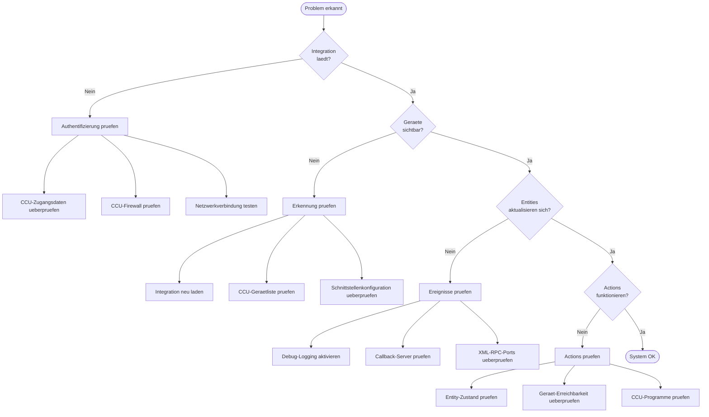
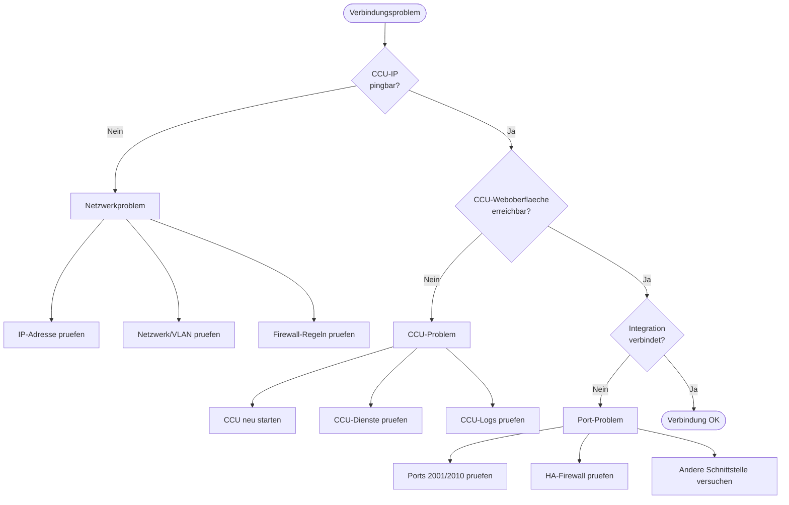
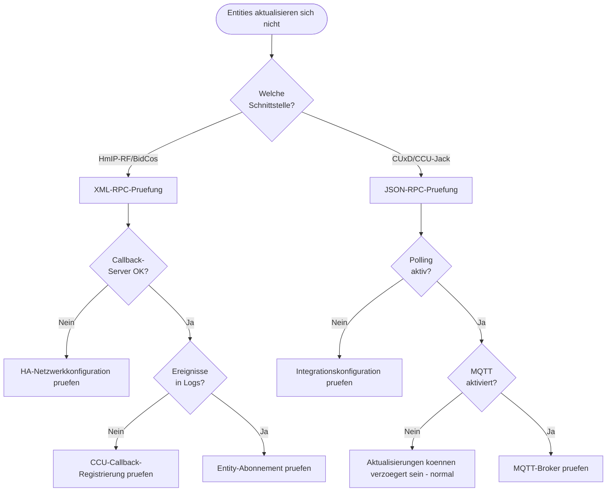
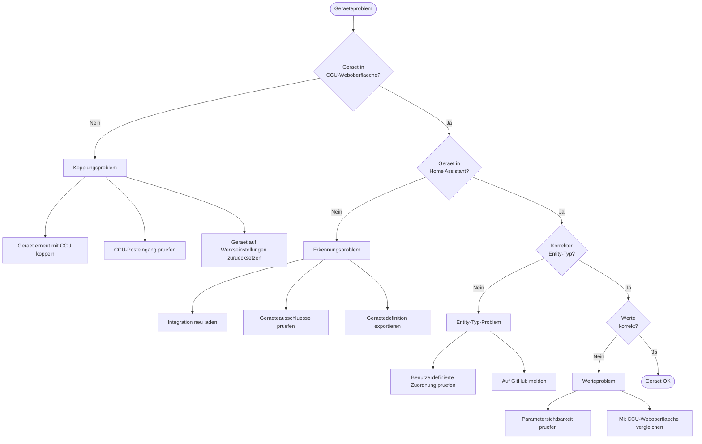

# Fehlerbehebungs-Ablaufdiagramm

Diese visuelle Anleitung hilft bei der Diagnose und Behebung haeufiger Probleme mit der Homematic(IP) Local-Integration.

## Schnelldiagnose



## Verbindungsprobleme



## Probleme bei Entity-Aktualisierungen



## Geraetespezifische Probleme



## Schritt-fuer-Schritt-Diagnose

### Schritt 1: Grundlegende Konnektivitaet ueberpruefen

1. **CCU anpingen**:

   ```bash
   ping YOUR_CCU_IP
   ```

2. **CCU-Weboberflaeche aufrufen**: `http://YOUR_CCU_IP` im Browser oeffnen

3. **HA-Logs auf Verbindungsfehler pruefen**:
   ```yaml
   logger:
     logs:
       aiohomematic: debug
   ```

### Schritt 2: Schnittstellenstatus pruefen

In Home Assistant:

1. Zu **Einstellungen** -> **Geraete & Dienste** navigieren
2. Auf **Homematic(IP) Local** -> **Konfigurieren** klicken
3. Schnittstellenstatus pruefen (verbunden/getrennt)

### Schritt 3: Ereignisfluss ueberpruefen

Debug-Logging aktivieren und nach Folgendem suchen:

```
# Gut - Ereignisse kommen an
Received event: interface=HmIP-RF channel=XXXX:1 parameter=STATE value=True

# Schlecht - Keine Ereignisse
No events received for 180 seconds
```

### Schritt 4: Actions testen

Eine einfache Action in Entwicklerwerkzeuge -> Dienste ausprobieren:

```yaml
action: homematicip_local.set_device_value
data:
  device_id: YOUR_DEVICE_ID
  channel: 1
  parameter: STATE
  value: "true"
  value_type: boolean
```

## Kurzreferenz haeufiger Probleme

| Symptom                       | Wahrscheinliche Ursache               | Loesung                             |
| ----------------------------- | ------------------------------------- | ----------------------------------- |
| "Connection refused"          | CCU nicht erreichbar                  | Netzwerk und Firewall pruefen       |
| "Authentication failed"       | Falsche Zugangsdaten                  | Benutzername/Passwort ueberpruefen  |
| Entities zeigen "unavailable" | Verbindung unterbrochen               | CCU pruefen, Integration neu laden  |
| Keine Entity-Aktualisierungen | Callback funktioniert nicht           | HA-Netzwerkkonfiguration pruefen    |
| Falscher Entity-Typ           | Fehlende benutzerdefinierte Zuordnung | Auf GitHub melden                   |
| CUxD-Geraete langsam          | Normal bei Polling                    | MQTT-Einrichtung in Betracht ziehen |

## Debug-Log-Stufen

| Stufe     | Angezeigte Informationen                      | Verwendungszweck        |
| --------- | --------------------------------------------- | ----------------------- |
| `warning` | Fehler und Warnungen                          | Normalbetrieb           |
| `info`    | Verbindungsstatus, Ereignisse                 | Einfache Fehlerbehebung |
| `debug`   | Alle RPC-Aufrufe, vollstaendige Ereignisdaten | Detaillierte Diagnose   |

### Debug-Logging aktivieren

**Einfachste Methode** - Ueber die Home Assistant-Oberflaeche aktivieren:

1. Zu **Einstellungen** -> **Geraete & Dienste** -> **Homematic(IP) Local** navigieren
2. Auf **Konfigurieren** -> **Debug-Logging aktivieren** klicken
3. Das Problem reproduzieren
4. Auf **Debug-Logging deaktivieren** klicken - das Debug-Log wird als Datei zum Download angeboten

**Alternative** - Ueber YAML-Konfiguration:

```yaml
logger:
  default: warning
  logs:
    aiohomematic: debug
    custom_components.homematicip_local: debug
```

## Wann ein Issue eroeffnet werden sollte

Ein GitHub-Issue eroeffnen, wenn:

1. **Fehler**: Unerwartetes Verhalten nach Durchfuehrung der Fehlerbehebungsschritte
2. **Fehlende Geraeteunterstuetzung**: Geraet funktioniert in der CCU, aber nicht in HA
3. **Falscher Entity-Typ**: Geraet erzeugt falsche Entity (Sensor statt Schalter)

**Im Issue angeben**:

- [ ] Home Assistant-Version
- [ ] aiohomematic-Version
- [ ] CCU-Typ und Firmware
- [ ] Debug-Logs (sensible Informationen entfernen)
- [ ] Geraetedefinitions-Export (bei Geraeteproblemen)

### Geraetedefinition exportieren

```yaml
action: homematicip_local.export_device_definition
data:
  device_id: YOUR_DEVICE_ID
```

## Siehe auch

- [Fehlerbehebungsanleitung](homeassistant_troubleshooting.md) - Detaillierte Fehlerbehebung
- [CUxD und CCU-Jack](../advanced/cuxd_ccu_jack.md) - Spezielle Schnittstellenbehandlung
- [Geraeteunterstuetzung](../device_support.md) - Wie Geraete unterstuetzt werden
