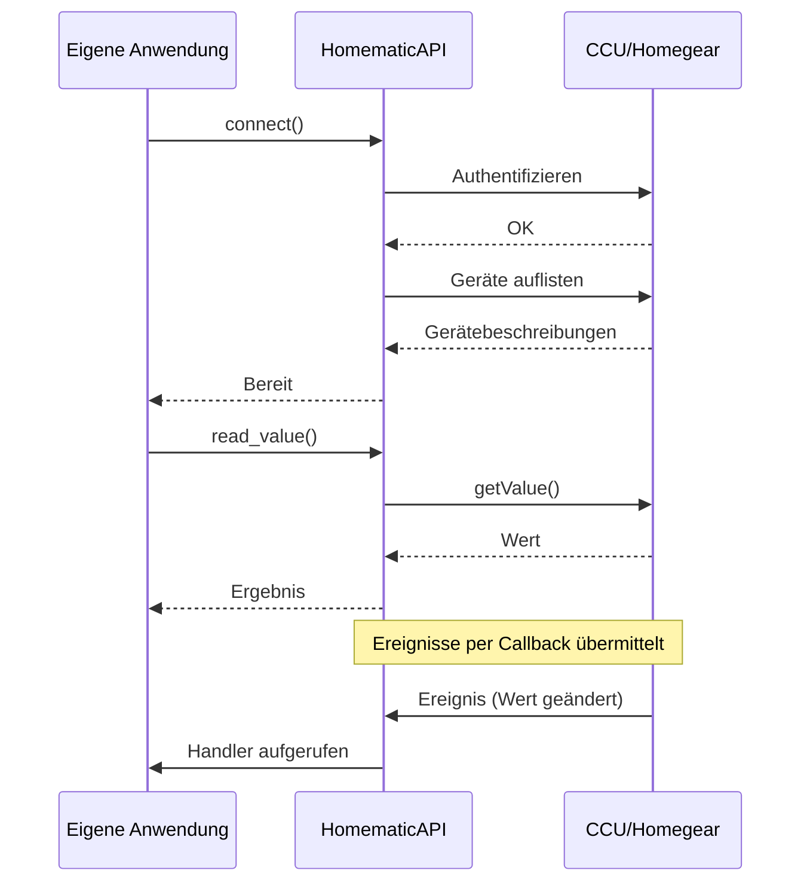

# Schnellstart

aiohomematic in 5 Minuten zum Laufen bringen.

## So funktioniert es



## Voraussetzungen

- Python 3.14+
- Ein Homematic-Backend (CCU3, OpenCCU, Homegear, etc.)
- Netzwerkzugang zum Backend

## Installation

```bash
pip install aiohomematic
```

## Verbinden und Geräte auflisten

```python
import asyncio
from aiohomematic.api import HomematicAPI


async def main():
    # Async-Kontextmanager für automatisches Aufräumen verwenden
    async with HomematicAPI.connect(
        host="192.168.1.100",     # (1)!
        username="Admin",         # (2)!
        password="your-password", # (3)!
    ) as api:
        # Alle erkannten Geräte durchlaufen
        for device in api.list_devices():
            print(f"{device.address}: {device.name} ({device.model})")
        # Verbindung wird beim Verlassen des Kontexts automatisch geschlossen


asyncio.run(main())
```

1. Durch die IP-Adresse oder den Hostnamen der CCU ersetzen
2. Groß-/Kleinschreibung beachten! Genau wie in der CCU angezeigt verwenden
3. Siehe [Sicherheit](user/advanced/security.md) für Passwortanforderungen

**Ausgabe:**

```
VCU0000001: Living Room Light (HmIP-BSM)
VCU0000002: Hallway Switch (HmIP-PS)
VCU0000003: Bedroom Thermostat (HmIP-eTRV-2)
```

## Einen Wert lesen

```python
async with HomematicAPI.connect(...) as api:
    # Schalter-Status lesen
    state = await api.read_value(
        channel_address="VCU0000001:3",
        parameter="STATE",
    )
    print(f"Switch is {'ON' if state else 'OFF'}")
```

## Einen Wert schreiben

```python
async with HomematicAPI.connect(...) as api:
    # Einen Schalter einschalten
    await api.write_value(
        channel_address="VCU0000001:3",
        parameter="STATE",
        value=True,
    )
    print("Switch turned ON")
```

## Ereignisse abonnieren

```python
from typing import Any


def on_update(address: str, parameter: str, value: Any) -> None:
    print(f"{address}.{parameter} = {value}")


async with HomematicAPI.connect(...) as api:
    # Alle Wertänderungen abonnieren
    unsubscribe = api.subscribe_to_updates(callback=on_update)

    # Weiterlaufen lassen, um Ereignisse zu empfangen
    await asyncio.sleep(60)

    # Empfang von Ereignissen beenden
    unsubscribe()
```

## Vollständiges Beispiel

```python
"""Vollständiges aiohomematic-Schnellstart-Beispiel."""

import asyncio
from typing import Any

from aiohomematic.api import HomematicAPI


def on_update(address: str, parameter: str, value: Any) -> None:
    """Wertänderungen verarbeiten."""
    print(f"UPDATE: {address}.{parameter} = {value}")


async def main() -> None:
    """Haupteinstiegspunkt."""
    async with HomematicAPI.connect(
        host="192.168.1.100",
        username="Admin",
        password="your-password",
    ) as api:
        # 1. Geräte auflisten
        print("=== Devices ===")
        for device in api.list_devices():
            print(f"  {device.address}: {device.name}")

        # 2. Ein bestimmtes Gerät suchen
        device = api.get_device(address="VCU0000001")
        if device:
            print(f"\n=== Device Details ===")
            print(f"  Model: {device.model}")
            print(f"  Firmware: {device.firmware}")

            # 3. Kanäle und Datenpunkte auflisten
            for channel_no, channel in device.channels.items():
                print(f"\n  Channel {channel_no}:")
                for param, dp in channel.data_points.items():
                    print(f"    {param}: {dp.value}")

        # 4. Aktualisierungen abonnieren
        unsubscribe = api.subscribe_to_updates(callback=on_update)

        # 5. Einen Schalter umschalten (falls vorhanden)
        try:
            current = await api.read_value(
                channel_address="VCU0000001:3",
                parameter="STATE",
            )
            await api.write_value(
                channel_address="VCU0000001:3",
                parameter="STATE",
                value=not current,
            )
            print(f"\nToggled switch from {current} to {not current}")
        except Exception as e:
            print(f"\nCould not toggle switch: {e}")

        # 6. Auf Ereignisse warten
        print("\nWaiting for events (10 seconds)...")
        await asyncio.sleep(10)

        unsubscribe()
        print("\nDone!")


if __name__ == "__main__":
    asyncio.run(main())
```

## Nächste Schritte

- [Erste Schritte](getting_started.md) - Detaillierte Einrichtungsanleitung
- [Gängige Operationen](reference/common_operations.md) - Weitere Codebeispiele
- [Consumer API](developer/consumer_api.md) - Vollständige API-Dokumentation
- [Häufige Fragen](faq.md) - Antworten auf gängige Fragen
