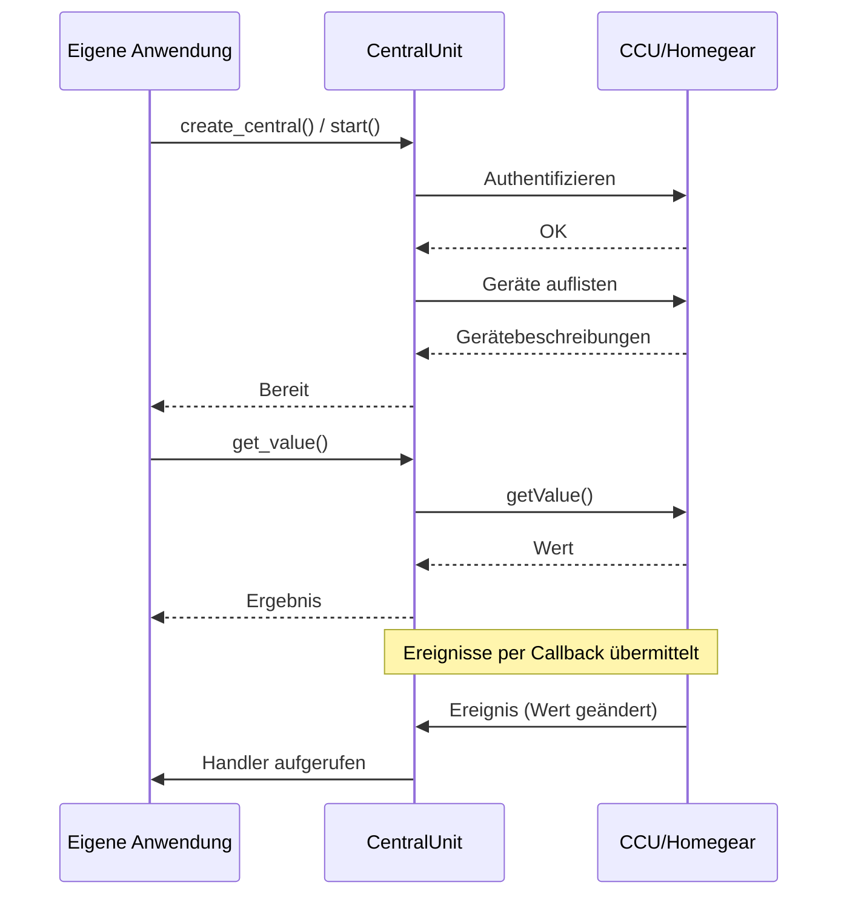

# Schnellstart

aiohomematic in 5 Minuten mit `CentralConfig` und `CentralUnit` zum Laufen bringen.

## So funktioniert es


```mermaid
sequenceDiagram
    participant App as Eigene Anwendung
    participant Central as CentralUnit
    participant CCU as CCU/Homegear

    App->>Central: create_central() / start()
    Central->>CCU: Authentifizieren
    CCU-->>Central: OK
    Central->>CCU: Geräte auflisten
    CCU-->>Central: Gerätebeschreibungen
    Central-->>App: Bereit

    App->>Central: get_value()
    Central->>CCU: getValue()
    CCU-->>Central: Wert
    Central-->>App: Ergebnis

    Note over CCU,Central: Ereignisse per Callback übermittelt
    CCU->>Central: Ereignis (Wert geändert)
    Central->>App: Handler aufgerufen
```

## Voraussetzungen

- Python 3.14+
- Ein Homematic-Backend (CCU3, OpenCCU, Homegear, etc.)
- Netzwerkzugang zum Backend

## Installation

```bash
pip install aiohomematic
```

## Verbinden und Geräte auflisten

```python
import asyncio
from aiohomematic.central import CentralConfig


async def main():
    config = CentralConfig.for_ccu(
        host="192.168.1.100",     # (1)!
        username="Admin",         # (2)!
        password="your-password", # (3)!
    )
    central = await config.create_central()
    await central.start()

    try:
        # Alle erkannten Geräte durchlaufen
        for device in central.devices:
            print(f"{device.address}: {device.name} ({device.model})")
    finally:
        # CentralUnit immer stoppen, um Ressourcen freizugeben
        await central.stop()


asyncio.run(main())
```

1. Durch die IP-Adresse oder den Hostnamen der CCU ersetzen
2. Groß-/Kleinschreibung beachten! Genau wie in der CCU angezeigt verwenden
3. Siehe [Sicherheit](user/advanced/security.md) für Passwortanforderungen

**Ausgabe:**

```
VCU0000001: Living Room Light (HmIP-BSM)
VCU0000002: Hallway Switch (HmIP-PS)
VCU0000003: Bedroom Thermostat (HmIP-eTRV-2)
```

## Einen Wert lesen

```python
from aiohomematic.const import ParamsetKey

# Schalter-Status über den Client des zuständigen Interfaces lesen
device = central.device_coordinator.get_device(address="VCU0000001")
client = central.client_coordinator.get_client(interface_id=device.interface_id)
state = await client.get_value(
    channel_address="VCU0000001:3",
    paramset_key=ParamsetKey.VALUES,
    parameter="STATE",
)
print(f"Switch is {'ON' if state else 'OFF'}")
```

## Einen Wert schreiben

```python
from aiohomematic.const import ParamsetKey

# Einen Schalter über den Client des zuständigen Interfaces einschalten
device = central.device_coordinator.get_device(address="VCU0000001")
client = central.client_coordinator.get_client(interface_id=device.interface_id)
await client.set_value(
    channel_address="VCU0000001:3",
    paramset_key=ParamsetKey.VALUES,
    parameter="STATE",
    value=True,
)
print("Switch turned ON")
```

## Ereignisse abonnieren

```python
from aiohomematic.central.events import DataPointValueReceivedEvent


async def on_update(*, event: DataPointValueReceivedEvent) -> None:
    print(f"{event.dpk.channel_address}.{event.dpk.parameter} = {event.value}")


# Alle Wertänderungen abonnieren
unsubscribe = central.event_bus.subscribe(
    event_type=DataPointValueReceivedEvent,
    event_key=None,
    handler=on_update,
)

# Weiterlaufen lassen, um Ereignisse zu empfangen
await asyncio.sleep(60)

# Empfang von Ereignissen beenden
unsubscribe()
```

## Vollständiges Beispiel

```python
"""Vollständiges aiohomematic-Schnellstart-Beispiel."""

import asyncio

from aiohomematic.central import CentralConfig
from aiohomematic.central.events import DataPointValueReceivedEvent
from aiohomematic.const import ParamsetKey


async def on_update(*, event: DataPointValueReceivedEvent) -> None:
    """Wertänderungen verarbeiten."""
    print(f"UPDATE: {event.dpk.channel_address}.{event.dpk.parameter} = {event.value}")


async def main() -> None:
    """Haupteinstiegspunkt."""
    config = CentralConfig.for_ccu(
        host="192.168.1.100",
        username="Admin",
        password="your-password",
    )
    central = await config.create_central()
    await central.start()

    try:
        # 1. Geräte auflisten
        print("=== Devices ===")
        for device in central.devices:
            print(f"  {device.address}: {device.name}")

        # 2. Ein bestimmtes Gerät suchen
        device = central.device_coordinator.get_device(address="VCU0000001")
        if device:
            print("\n=== Device Details ===")
            print(f"  Model: {device.model}")
            print(f"  Firmware: {device.firmware}")

            # 3. Kanäle und Datenpunkte auflisten
            for channel_address, channel in device.channels.items():
                print(f"\n  Channel {channel.no} ({channel_address}):")
                for dp in channel.generic_data_points:
                    print(f"    {dp.parameter}: {dp.value}")

        # 4. Aktualisierungen abonnieren
        unsubscribe = central.event_bus.subscribe(
            event_type=DataPointValueReceivedEvent,
            event_key=None,
            handler=on_update,
        )

        # 5. Einen Schalter umschalten (falls vorhanden)
        try:
            client = central.client_coordinator.get_client(interface_id=device.interface_id)
            current = await client.get_value(
                channel_address="VCU0000001:3",
                paramset_key=ParamsetKey.VALUES,
                parameter="STATE",
            )
            await client.set_value(
                channel_address="VCU0000001:3",
                paramset_key=ParamsetKey.VALUES,
                parameter="STATE",
                value=not current,
            )
            print(f"\nToggled switch from {current} to {not current}")
        except Exception as e:
            print(f"\nCould not toggle switch: {e}")

        # 6. Auf Ereignisse warten
        print("\nWaiting for events (10 seconds)...")
        await asyncio.sleep(10)

        unsubscribe()
        print("\nDone!")
    finally:
        await central.stop()


if __name__ == "__main__":
    asyncio.run(main())
```

## Nächste Schritte

- [Erste Schritte](getting_started.md) - Detaillierte Einrichtungsanleitung
- [Gängige Operationen](reference/common_operations.md) - Weitere Codebeispiele
- [Consumer API](developer/consumer_api.md) - Vollständige API-Dokumentation
- [Häufige Fragen](faq.md) - Antworten auf gängige Fragen
