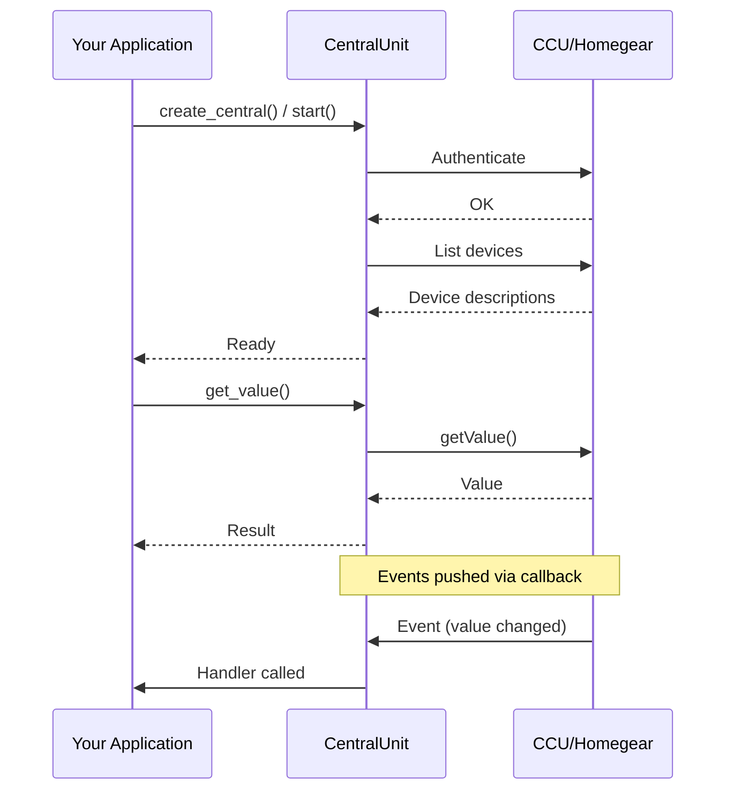

# Quick Start

Get aiohomematic running in 5 minutes using `CentralConfig` and `CentralUnit`.

> **When to use this page:** you want a working connection with the fewest lines of code.
> **Going deeper?** [Getting Started](getting_started.md) walks through the same setup plus lifecycle management, interface configuration, and advanced `CentralUnit` usage.

## How It Works


```mermaid
sequenceDiagram
    participant App as Your Application
    participant Central as CentralUnit
    participant CCU as CCU/Homegear

    App->>Central: create_central() / start()
    Central->>CCU: Authenticate
    CCU-->>Central: OK
    Central->>CCU: List devices
    CCU-->>Central: Device descriptions
    Central-->>App: Ready

    App->>Central: get_value()
    Central->>CCU: getValue()
    CCU-->>Central: Value
    Central-->>App: Result

    Note over CCU,Central: Events pushed via callback
    CCU->>Central: Event (value changed)
    Central->>App: Handler called
```

## Prerequisites

- Python 3.14+
- A Homematic backend (CCU3, OpenCCU, Homegear, etc.)
- Network access to your backend

## Install

```bash
pip install aiohomematic
```

## Connect and List Devices

```python
import asyncio
from aiohomematic.central import CentralConfig


async def main():
    config = CentralConfig.for_ccu(
        host="192.168.1.100",     # (1)!
        username="Admin",         # (2)!
        password="your-password", # (3)!
    )
    central = await config.create_central()
    await central.start()

    try:
        # Iterate over all discovered devices
        for device in central.devices:
            print(f"{device.address}: {device.name} ({device.model})")
    finally:
        # Always stop the central unit to release resources
        await central.stop()


asyncio.run(main())
```

1. Replace with your CCU's IP address or hostname
2. Case-sensitive! Use exactly as shown in CCU
3. See [Security](user/advanced/security.md) for password requirements

**Output:**

```
VCU0000001: Living Room Light (HmIP-BSM)
VCU0000002: Hallway Switch (HmIP-PS)
VCU0000003: Bedroom Thermostat (HmIP-eTRV-2)
```

## Read a Value

```python
from aiohomematic.const import ParamsetKey

# Read switch state via the client for the device's interface
device = central.device_coordinator.get_device(address="VCU0000001")
client = central.client_coordinator.get_client(interface_id=device.interface_id)
state = await client.get_value(
    channel_address="VCU0000001:3",
    paramset_key=ParamsetKey.VALUES,
    parameter="STATE",
)
print(f"Switch is {'ON' if state else 'OFF'}")
```

## Write a Value

```python
from aiohomematic.const import ParamsetKey

# Turn on a switch via the client for the device's interface
device = central.device_coordinator.get_device(address="VCU0000001")
client = central.client_coordinator.get_client(interface_id=device.interface_id)
await client.set_value(
    channel_address="VCU0000001:3",
    paramset_key=ParamsetKey.VALUES,
    parameter="STATE",
    value=True,
)
print("Switch turned ON")
```

## Subscribe to Events

```python
from aiohomematic.central.events import DataPointValueReceivedEvent


async def on_update(*, event: DataPointValueReceivedEvent) -> None:
    print(f"{event.dpk.channel_address}.{event.dpk.parameter} = {event.value}")


# Subscribe to all value changes
unsubscribe = central.event_bus.subscribe(
    event_type=DataPointValueReceivedEvent,
    event_key=None,
    handler=on_update,
)

# Keep running to receive events
await asyncio.sleep(60)

# Stop receiving events
unsubscribe()
```

## Complete Example

```python
"""Complete aiohomematic quick start example."""

import asyncio

from aiohomematic.central import CentralConfig
from aiohomematic.central.events import DataPointValueReceivedEvent
from aiohomematic.const import ParamsetKey


async def on_update(*, event: DataPointValueReceivedEvent) -> None:
    """Handle value updates."""
    print(f"UPDATE: {event.dpk.channel_address}.{event.dpk.parameter} = {event.value}")


async def main() -> None:
    """Main entry point."""
    config = CentralConfig.for_ccu(
        host="192.168.1.100",
        username="Admin",
        password="your-password",
    )
    central = await config.create_central()
    await central.start()

    try:
        # 1. List devices
        print("=== Devices ===")
        for device in central.devices:
            print(f"  {device.address}: {device.name}")

        # 2. Find a specific device
        device = central.device_coordinator.get_device(address="VCU0000001")
        if device:
            print("\n=== Device Details ===")
            print(f"  Model: {device.model}")
            print(f"  Firmware: {device.firmware}")

            # 3. List channels and data points (channels is keyed by channel address)
            for channel_address, channel in device.channels.items():
                print(f"\n  Channel {channel.no} ({channel_address}):")
                for dp in channel.generic_data_points:
                    print(f"    {dp.parameter}: {dp.value}")

        # 4. Subscribe to updates
        unsubscribe = central.event_bus.subscribe(
            event_type=DataPointValueReceivedEvent,
            event_key=None,
            handler=on_update,
        )

        # 5. Toggle a switch (if exists)
        try:
            client = central.client_coordinator.get_client(interface_id=device.interface_id)
            current = await client.get_value(
                channel_address="VCU0000001:3",
                paramset_key=ParamsetKey.VALUES,
                parameter="STATE",
            )
            await client.set_value(
                channel_address="VCU0000001:3",
                paramset_key=ParamsetKey.VALUES,
                parameter="STATE",
                value=not current,
            )
            print(f"\nToggled switch from {current} to {not current}")
        except Exception as e:
            print(f"\nCould not toggle switch: {e}")

        # 6. Wait for some events
        print("\nWaiting for events (10 seconds)...")
        await asyncio.sleep(10)

        unsubscribe()
        print("\nDone!")
    finally:
        await central.stop()


if __name__ == "__main__":
    asyncio.run(main())
```

## Next Steps

- [Getting Started](getting_started.md) - Detailed setup guide
- [Common Operations](reference/common_operations.md) - More code examples
- [Consumer API](developer/consumer_api.md) - Full API documentation
- [FAQ](faq.md) - Common questions answered
