# Sequence diagrams: Connect, device discovery, state change propagation

This document provides Mermaid sequence diagrams for key flows in aiohomematic: initial connect, device discovery, state change propagation, client state machine, and EventBus architecture.

## 1. Connect (startup, clients, XML-RPC callback registration)

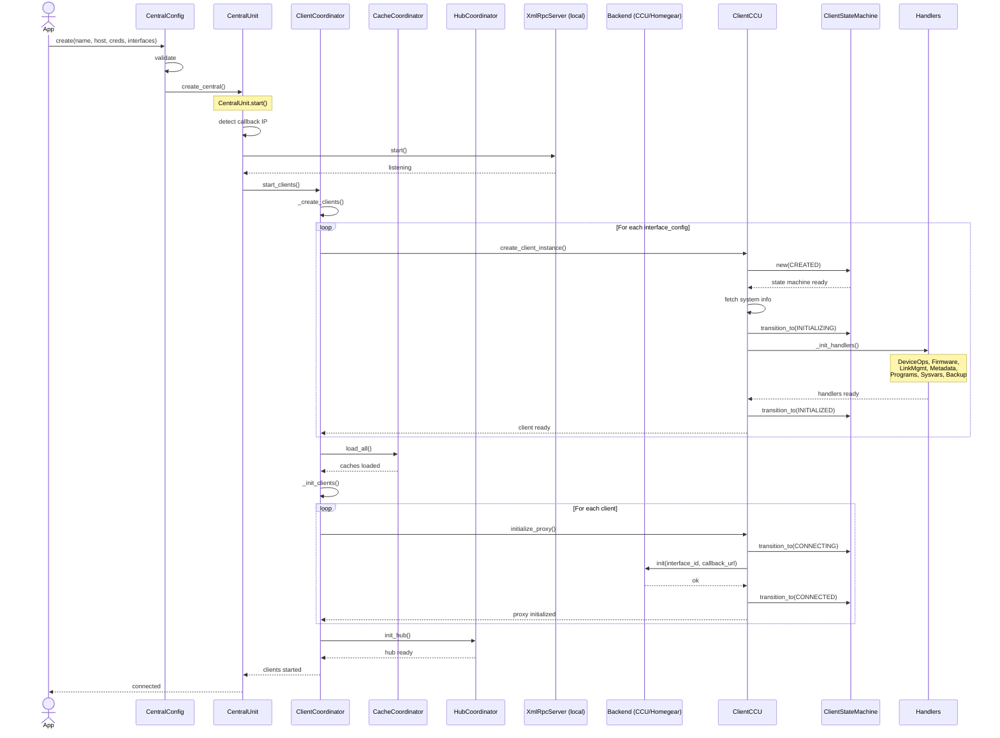

### Notes

- Central starts the local XML-RPC callback server before registering with the backend so the CCU can immediately deliver events.
- ClientCoordinator orchestrates client lifecycle: creation, cache loading, initialization, and hub setup.
- Each client uses a ClientStateMachine to enforce valid state transitions (CREATED → INITIALIZING → INITIALIZED → CONNECTING → CONNECTED).
- Handlers are initialized during client creation, providing specialized operations (device ops, firmware, metadata, etc.).

---

## 2. Device discovery (metadata fetch, model creation)

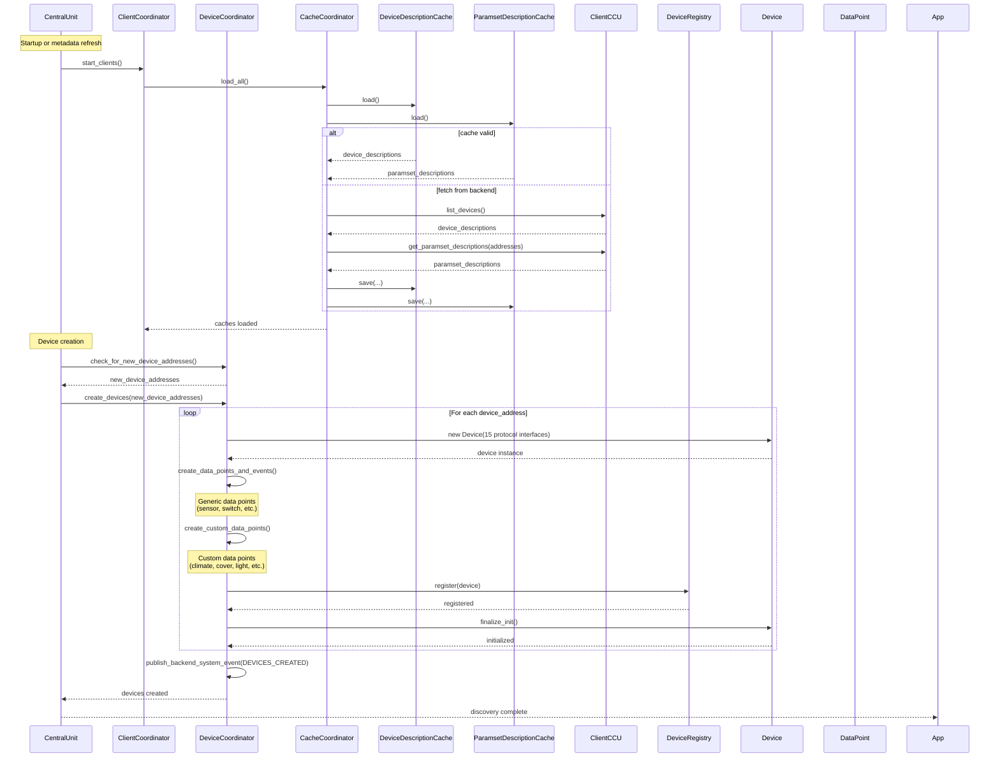

### Notes

- CacheCoordinator manages persistent caches (device descriptions, paramset descriptions) with disk persistence.
- DeviceCoordinator handles device creation with full protocol-based DI (15 protocol interfaces per device).
- Model creation is pure: no network I/O, just transformations from cached descriptions.
- Generic and custom data points are created based on paramset descriptions and device profiles.

---

## 3. State change propagation (event → EventBus → subscribers)

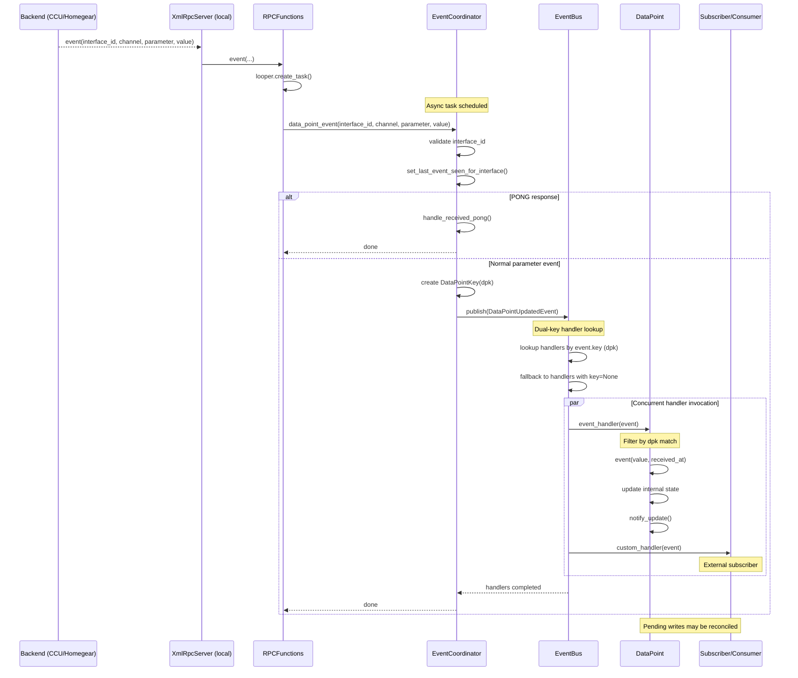

### Notes

- RPCFunctions schedules async tasks via looper to avoid blocking the XML-RPC callback thread.
- EventCoordinator creates typed events (DataPointUpdatedEvent) with DataPointKey for filtering.
- EventBus uses dual-key lookup: specific key (dpk) first, then wildcard (None) fallback.
- Handlers run concurrently via asyncio.gather with error isolation (one failure doesn't affect others).
- Both async and sync handlers are supported transparently.

---

## 4. Client state machine (lifecycle states and transitions)

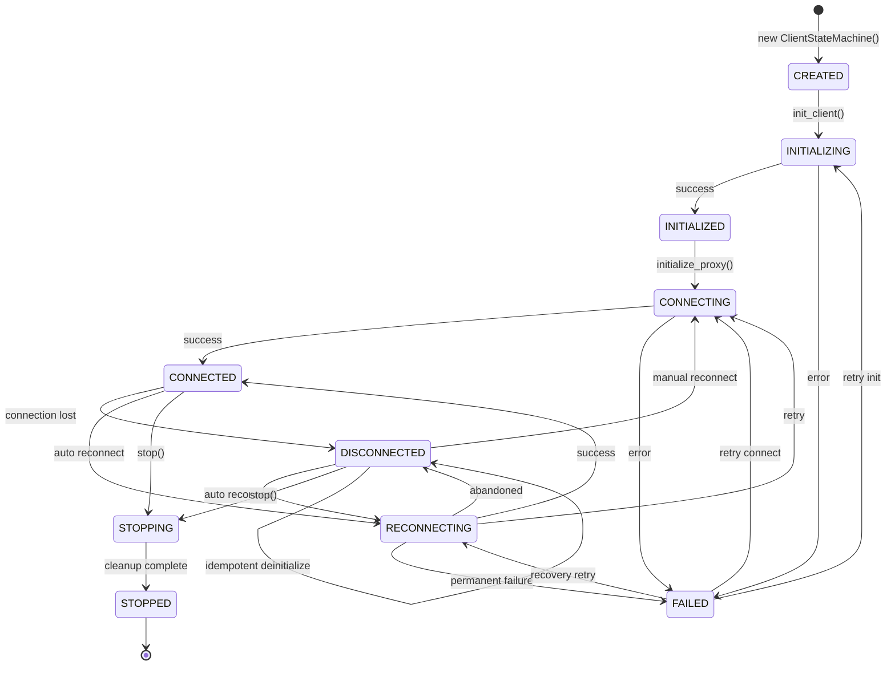

### State descriptions

| State        | Description                                               |
| ------------ | --------------------------------------------------------- |
| CREATED      | Initial state after client instantiation                  |
| INITIALIZING | Loading metadata, creating proxies, initializing handlers |
| INITIALIZED  | Ready to establish connection to backend                  |
| CONNECTING   | Registering callback with backend via XML-RPC init()      |
| CONNECTED    | Fully operational, receiving events                       |
| DISCONNECTED | Connection lost or intentionally closed                   |
| RECONNECTING | Automatic reconnection attempt in progress                |
| STOPPING     | Graceful shutdown in progress                             |
| STOPPED      | Terminal state, no further transitions                    |
| FAILED       | Error state, allows retry via re-initialization           |

### State change callback

The ClientStateMachine supports a typed callback for state changes:

```python
from aiohomematic.client.state_machine import ClientStateMachine, StateChangeCallbackProtocol
from aiohomematic.const import ClientState

def on_state_change(*, old_state: ClientState, new_state: ClientState) -> None:
    print(f"Client state changed: {old_state} -> {new_state}")

sm = ClientStateMachine(interface_id="ccu-main-HmIP-RF")
sm.on_state_change = on_state_change  # Must match StateChangeCallbackProtocol protocol
```

### Notes

- ClientStateMachine enforces valid transitions and raises InvalidStateTransitionError for invalid ones.
- State changes are logged for debugging and can trigger optional callbacks.
- The DISCONNECTED state allows idempotent deinitialize calls (self-transition).
- FAILED state provides recovery paths back to INITIALIZING, CONNECTING, or RECONNECTING.
- Callback signature uses keyword-only arguments (`*, old_state, new_state`) for type safety.

---

## 4a. Central state machine (system health orchestration)

The CentralStateMachine manages the overall state of the system based on individual client states. It acts as an orchestrator above the per-client state machines.

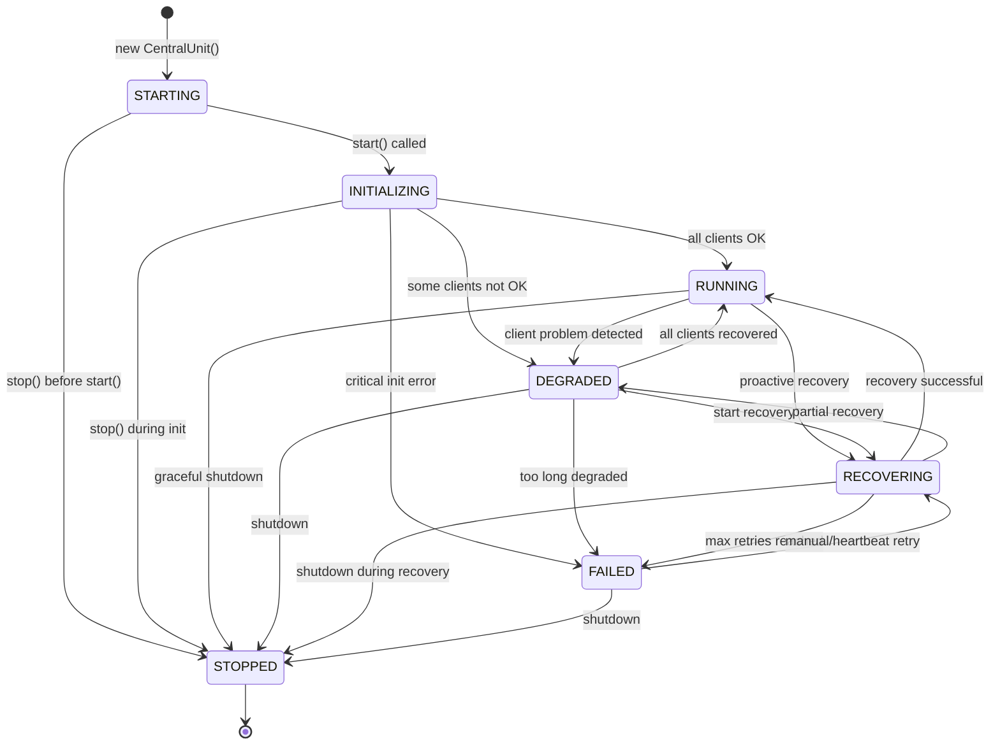

### Central state descriptions

| State        | Description                                          | Exit Conditions                               |
| ------------ | ---------------------------------------------------- | --------------------------------------------- |
| STARTING     | Central is being created, no clients initialized yet | `start()` called or `stop()` before start     |
| INITIALIZING | Clients are being created and initialized            | All OK → RUNNING, some fail → DEGRADED        |
| RUNNING      | All clients are CONNECTED and healthy                | Client problem → DEGRADED or RECOVERING       |
| DEGRADED     | At least one client is not CONNECTED                 | Recovery → RECOVERING, all OK → RUNNING       |
| RECOVERING   | Active recovery of failed clients in progress        | Success → RUNNING, partial → DEGRADED         |
| FAILED       | Max retries reached, manual intervention required    | Manual retry → RECOVERING, shutdown → STOPPED |
| STOPPED      | Terminal state, central is fully stopped             | None (terminal)                               |

### State transition rules

The CentralStateMachine enforces a strict set of valid transitions:

```python
VALID_CENTRAL_TRANSITIONS = {
    CentralState.STARTING: {INITIALIZING, STOPPED},
    CentralState.INITIALIZING: {RUNNING, DEGRADED, FAILED, STOPPED},
    CentralState.RUNNING: {DEGRADED, RECOVERING, STOPPED},
    CentralState.DEGRADED: {RUNNING, RECOVERING, FAILED, STOPPED},
    CentralState.RECOVERING: {RUNNING, DEGRADED, FAILED, STOPPED},
    CentralState.FAILED: {RECOVERING, STOPPED},
    CentralState.STOPPED: {},  # Terminal - no transitions allowed
}
```

### Event emission

State changes are published to the EventBus as `CentralStateChangedEvent`:

```python
@dataclass
class CentralStateChangedEvent:
    timestamp: datetime
    old_state: CentralState
    new_state: CentralState
    reason: str
```

### Notes

- RUNNING requires ALL clients to be CONNECTED (user-chosen conservative approach).
- DEGRADED allows operations with reduced functionality.
- FAILED state includes heartbeat retry mechanism every 60 seconds.
- State history is maintained (last 100 transitions) for debugging.
- Thread Safety: NOT thread-safe, all calls should happen from the same event loop.

---

## 5. EventBus architecture (subscription and publishing)

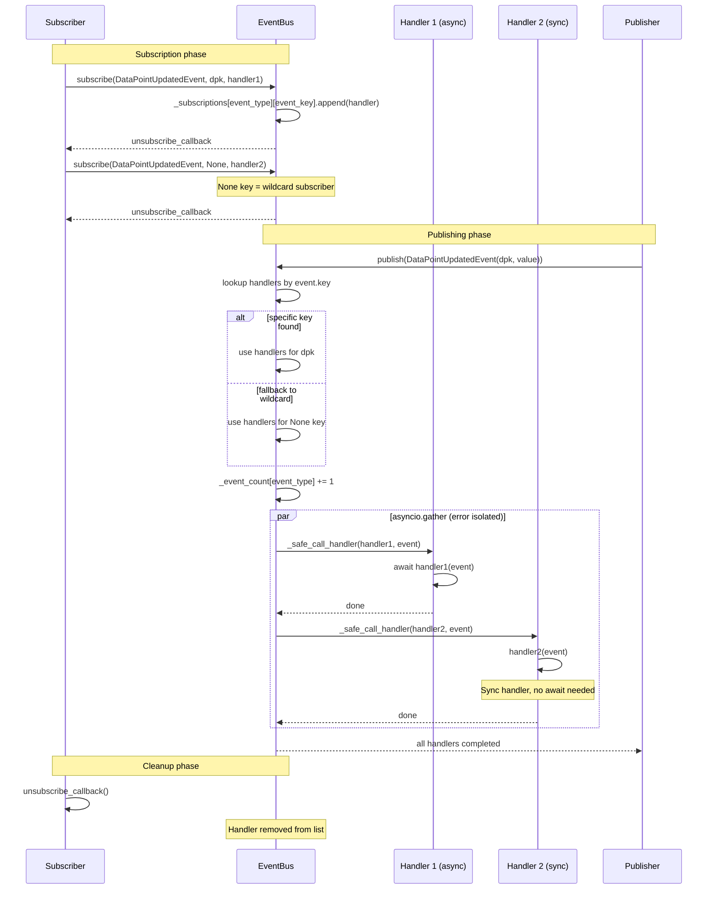

### Event types

| Event                         | Key             | Description                           |
| ----------------------------- | --------------- | ------------------------------------- |
| DataPointUpdatedEvent         | DataPointKey    | Backend data point value update       |
| BackendParameterEvent         | DataPointKey    | Raw parameter event from RPC          |
| BackendSystemEventData        | None            | System events (DEVICES_CREATED, etc.) |
| HomematicEvent                | None            | Homematic events (KEYPRESS, etc.)     |
| SysvarUpdatedEvent            | state_path      | System variable update                |
| InterfaceEvent                | interface_id    | Interface state changes               |
| DeviceUpdatedEvent            | device_address  | Device state update                   |
| FirmwareUpdatedEvent          | device_address  | Firmware info update                  |
| LinkPeerChangedEvent          | channel_address | Channel link changes                  |
| DataPointUpdatedCallbackEvent | unique_id       | External integration notification     |
| DeviceRemovedEvent            | unique_id       | Device/data point removal             |

### Notes

- EventBus is async-first but supports both sync and async handlers transparently.
- Dual-key lookup: specific event.key first, then None (wildcard) fallback.
- Error isolation via return_exceptions=True in asyncio.gather.
- Memory management: clear_subscriptions_by_key() for cleanup when devices are removed.
- Event statistics tracked for debugging via get_event_stats().

---

## 6. Handler architecture (specialized client operations)


### Notes

- ClientCCU delegates operations to specialized handler classes for separation of concerns.
- All handlers extend BaseHandler which provides common dependencies via ClientDependencies protocol.
- Handlers receive protocol interfaces (not direct CentralUnit references) for decoupled architecture.
- Each handler focuses on a specific domain: device ops, firmware, linking, metadata, programs, sysvars, backup.

---

## 7. Client reconnection flow (connection recovery)

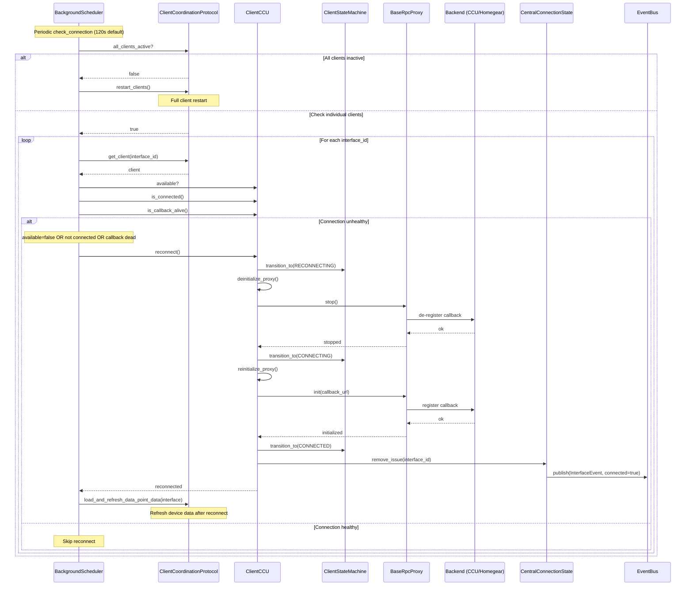

### Connection health checks

| Check            | Method                          | Description                           |
| ---------------- | ------------------------------- | ------------------------------------- |
| Client available | `client.available`              | Client not in error state             |
| Proxy connected  | `client.is_connected()`         | Proxy init successful                 |
| Callback alive   | `client.is_callback_alive()`    | Events received within threshold      |
| Ping/Pong        | `check_connection_availability` | Backend responds to ping (if enabled) |

### State transitions during reconnect

```
CONNECTED → RECONNECTING → CONNECTING → CONNECTED
     │                          │
     └──────────────────────────┴───→ FAILED (on permanent error)
```

### Notes

- BackgroundScheduler runs `_check_connection` every 120 seconds (configurable via `RECONNECT_WAIT`).
- Reconnection is attempted for each unhealthy client independently.
- After successful reconnect, device data is refreshed via `load_and_refresh_data_point_data`.
- CentralConnectionState tracks issues and notifies external consumers (Home Assistant) via callbacks.

---

## 8. Cache invalidation strategy

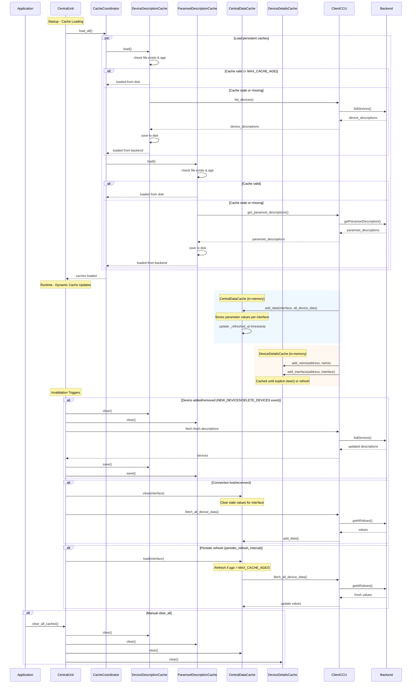

### Cache types and invalidation rules

| Cache                    | Type       | Storage | Invalidation Trigger                         | TTL             |
| ------------------------ | ---------- | ------- | -------------------------------------------- | --------------- |
| DeviceDescriptionCache   | Persistent | Disk    | NEW_DEVICES, DELETE_DEVICES, manual clear    | MAX_CACHE_AGE   |
| ParamsetDescriptionCache | Persistent | Disk    | Device structure change, manual clear        | MAX_CACHE_AGE   |
| CentralDataCache         | Dynamic    | Memory  | Reconnect, periodic refresh, interface clear | MAX_CACHE_AGE/3 |
| DeviceDetailsCache       | Dynamic    | Memory  | Explicit refresh, manual clear               | None (refresh)  |
| CommandCache             | Dynamic    | Memory  | TTL expiry per entry, clear on write confirm | Per-entry TTL   |
| PingPongCache            | Dynamic    | Memory  | Pong received, TTL expiry                    | Per-entry TTL   |
| ParameterVisibilityCache | Computed   | Memory  | Never (static rules)                         | Unbounded       |

### Notes

- **Persistent caches** survive restarts and reduce cold-start time.
- **Dynamic caches** are cleared on connection issues to ensure data freshness.
- **MAX_CACHE_AGE** default is typically 24 hours for persistent caches.
- **ParameterVisibilityCache** is intentionally unbounded (see ADR 0005).
- Backend events (NEW_DEVICES, DELETE_DEVICES) trigger cache invalidation automatically.

---

## 9. Week profile update flow

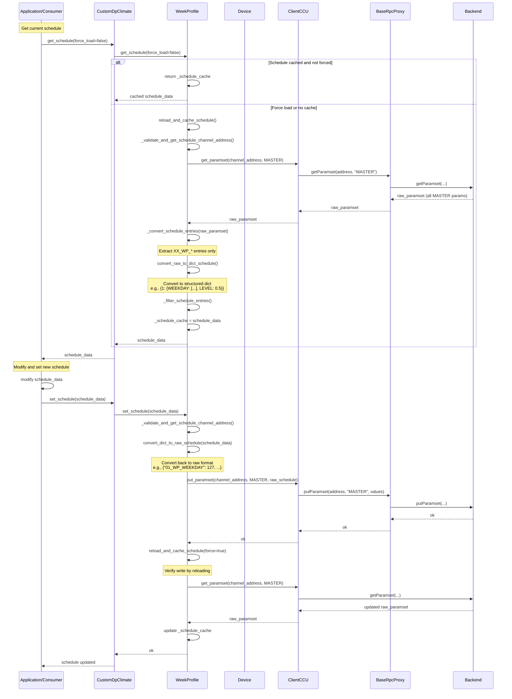

### Schedule data structure

```python
# Raw CCU format (MASTER paramset)
raw_schedule = {
    "01_WP_WEEKDAY": 127,        # Bitmask: all days
    "01_WP_LEVEL": 0.5,          # Target level (0.0-1.0)
    "01_WP_FIXED_HOUR": 6,       # Start hour
    "01_WP_FIXED_MINUTE": 0,     # Start minute
    "01_WP_ASTRO_TYPE": 0,       # Astro type enum
    "01_WP_CONDITION": 0,        # Condition enum
    # ... more entries for groups 01-10
}

# Structured Python format
schedule_data = {
    1: {
        ScheduleField.WEEKDAY: [Weekday.MONDAY, Weekday.TUESDAY, ...],
        ScheduleField.LEVEL: 0.5,
        ScheduleField.FIXED_HOUR: 6,
        ScheduleField.FIXED_MINUTE: 0,
        ScheduleField.ASTRO_TYPE: AstroType.NONE,
        ScheduleField.CONDITION: ScheduleCondition.NONE,
    },
    2: { ... },
    # ... up to 10 schedule groups
}
```

### Week profile types

| Type               | Device Types             | Schedule Fields                   |
| ------------------ | ------------------------ | --------------------------------- |
| DefaultWeekProfile | Switches, lights, covers | WEEKDAY, LEVEL, TIME, ASTRO, etc. |
| ClimateWeekProfile | Thermostats              | WEEKDAY, TEMPERATURE, TIME, etc.  |

### Notes

- Week profiles are stored in the MASTER paramset of the schedule channel.
- Schedules are cached after loading to avoid repeated backend calls.
- Conversion between raw CCU format and structured Python dicts is bidirectional.
- Setting a schedule triggers a reload to verify the write was successful.
- Schedule entries are identified by pattern `XX_WP_FIELDNAME` where XX is group number (01-10).

---

## 10. Connection health tracking

The health tracking system provides a unified view of connection health across all clients. It replaces overlapping availability systems with a single source of truth.

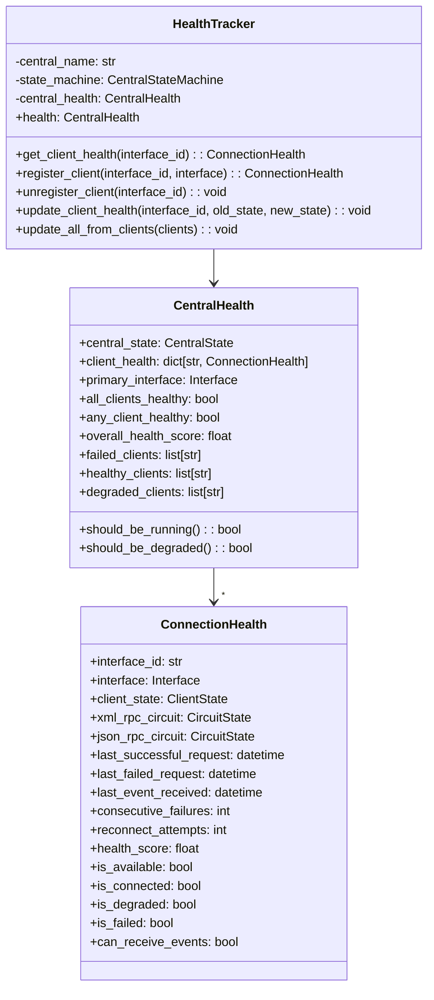

### Health score calculation

The health score (0.0 - 1.0) is calculated using weighted components:

| Component        | Weight | Calculation                                            |
| ---------------- | ------ | ------------------------------------------------------ |
| State Machine    | 40%    | CONNECTED = 100%, RECONNECTING = 50%, other = 0%       |
| Circuit Breakers | 30%    | CLOSED = 100%, HALF_OPEN = 33%, OPEN = 0%              |
| Recent Activity  | 30%    | Based on age of last request/event (<60s = 100%, etc.) |

### Health state determination

```python
# ConnectionHealth.is_available
is_available = (
    client_state == ClientState.CONNECTED
    and xml_rpc_circuit == CircuitState.CLOSED
    and (json_rpc_circuit is None or json_rpc_circuit == CircuitState.CLOSED)
)

# ConnectionHealth.is_degraded
is_degraded = (
    client_state in (CONNECTED, RECONNECTING)
    and (xml_rpc_circuit != CLOSED or json_rpc_circuit != CLOSED)
)

# CentralHealth.should_be_running
should_be_running = all_clients_healthy  # ALL clients must be CONNECTED
```

### Health update sequence

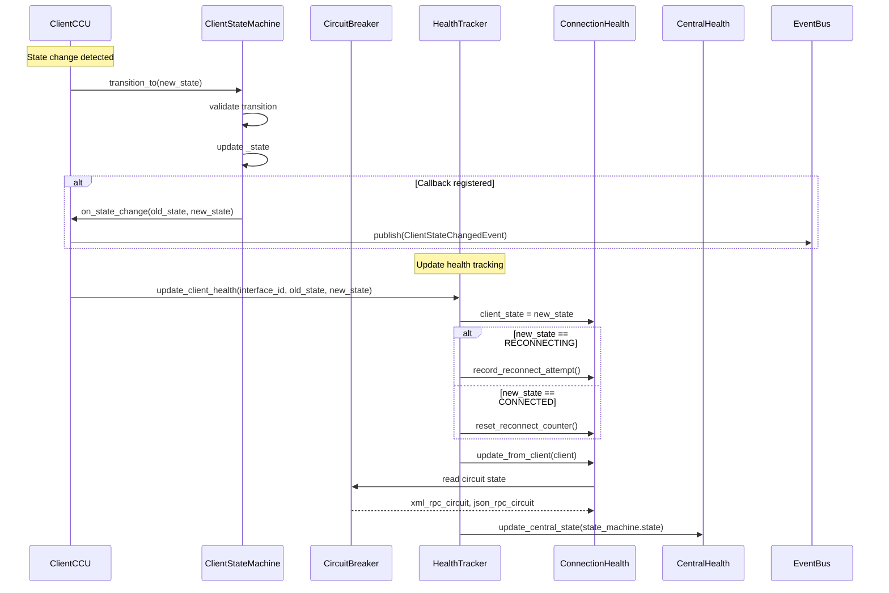

### Notes

- HealthTracker coordinates health tracking for all clients.
- ConnectionHealth uses hasattr checks to read circuit breaker state (proper protocol will be added in Phase 1.4).
- Event staleness threshold is 5 minutes (EVENT_STALENESS_THRESHOLD = 300s).
- Health is updated on state machine transitions and can be polled via `update_all_from_clients`.

---

## 11. Recovery coordinator (client reconnection orchestration)

The RecoveryCoordinator manages the recovery process for failed or degraded client connections with max retry tracking and multi-stage verification.

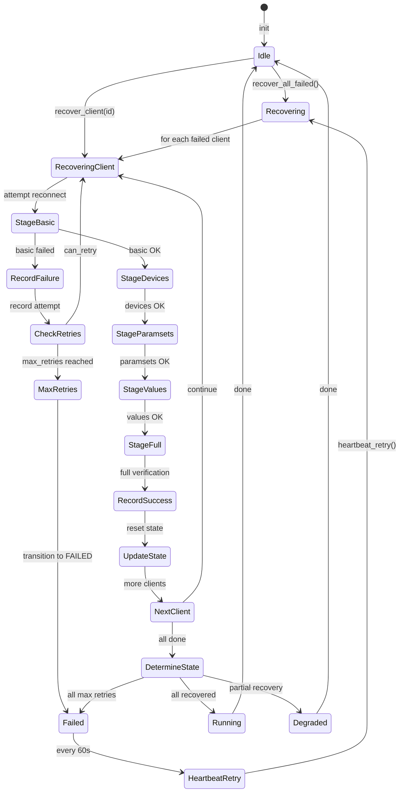

### Recovery result types

| Result      | Description                                 | Central State Transition |
| ----------- | ------------------------------------------- | ------------------------ |
| SUCCESS     | All clients recovered successfully          | → RUNNING                |
| PARTIAL     | Some clients recovered, others still failed | → DEGRADED               |
| FAILED      | Recovery failed but retries remain          | → DEGRADED               |
| MAX_RETRIES | Maximum retry attempts (8) reached          | → FAILED                 |
| CANCELLED   | Recovery cancelled (shutdown)               | (no change)              |

### Data load verification stages


### Recovery timing

| Parameter                | Value | Description                             |
| ------------------------ | ----- | --------------------------------------- |
| MAX_RECOVERY_ATTEMPTS    | 8     | Max retries before FAILED state         |
| HEARTBEAT_RETRY_INTERVAL | 60s   | Interval between heartbeat retries      |
| BASE_RETRY_DELAY         | 5s    | Initial delay between retries           |
| MAX_RETRY_DELAY          | 60s   | Maximum delay (exponential backoff cap) |

### Exponential backoff formula

```python
delay = min(BASE_RETRY_DELAY * (2 ** (consecutive_failures - 1)), MAX_RETRY_DELAY)
# failures=1: 5s, failures=2: 10s, failures=3: 20s, failures=4: 40s, failures=5+: 60s
```

### Recovery sequence

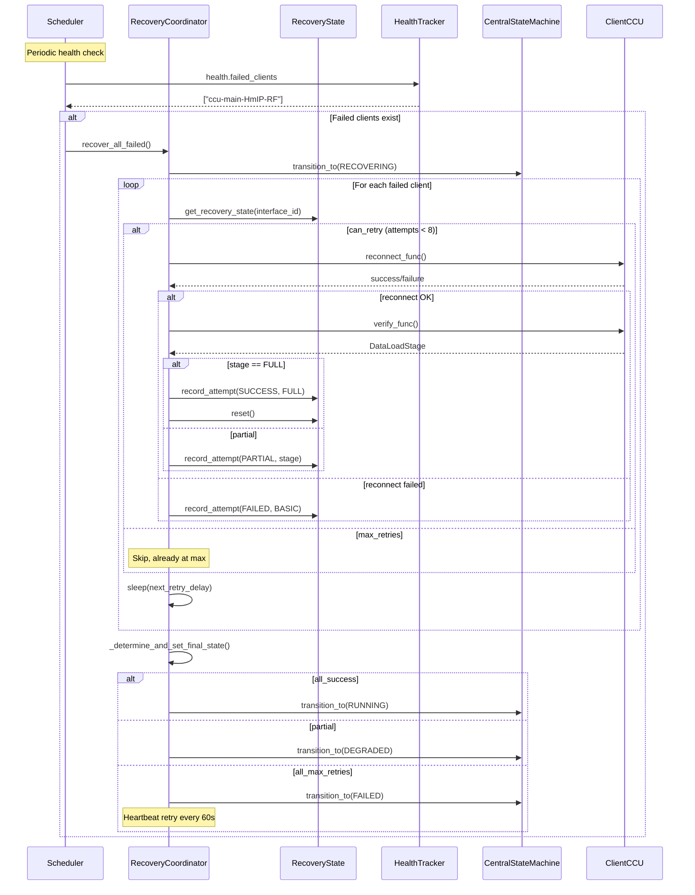

### Notes

- RecoveryCoordinator tracks per-interface recovery state (attempt count, history).
- History is limited to last 20 attempts per interface for memory management.
- In FAILED state, heartbeat retry resets attempt counter to allow one more try.
- Shutdown signal cancels any in-progress recovery.
- Thread Safety: NOT thread-safe, all calls should happen from the same event loop.

---

## 12. State machine integration overview

This diagram shows how the state machines, health tracking, and recovery coordinator work together.

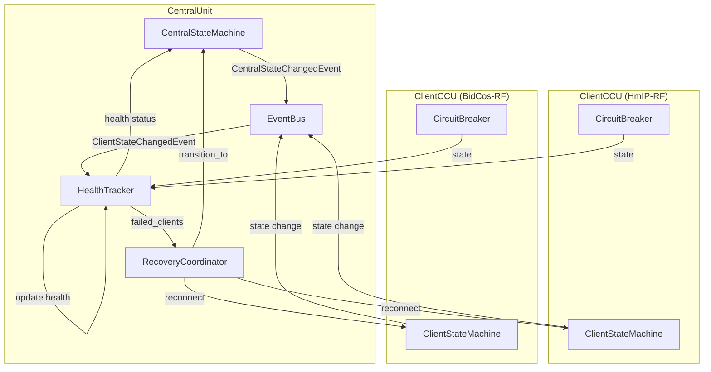

### State propagation flow

1. **Client state change**: ClientStateMachine transitions (e.g., CONNECTED → DISCONNECTED)
2. **Event emission**: Client emits ClientStateChangedEvent to EventBus
3. **Health update**: HealthTracker updates ConnectionHealth for the interface
4. **Central state evaluation**: CentralHealth determines if state change is needed
5. **Central transition**: CentralStateMachine transitions (e.g., RUNNING → DEGRADED)
6. **Central event**: CentralStateChangedEvent emitted for external consumers

### Key decision points

```python
# When to transition Central to DEGRADED
if central.is_running and not health.all_clients_healthy:
    central_sm.transition_to(CentralState.DEGRADED)

# When to start recovery
if central.is_degraded and health.failed_clients:
    recovery_coordinator.recover_all_failed()

# When to transition back to RUNNING
if central.is_degraded and health.all_clients_healthy:
    central_sm.transition_to(CentralState.RUNNING)

# When to enter FAILED state
if recovery_result == RecoveryResult.MAX_RETRIES:
    central_sm.transition_to(CentralState.FAILED)
```

### Notes

- All state machines follow the same pattern: validated transitions, event emission, callback support.
- CircuitBreakers are independent from state machines but contribute to health scoring.
- Recovery is automatic for failed clients, with exponential backoff.
- FAILED state is recoverable via heartbeat retry mechanism.

---

## See also

- [Architecture](../docs/architecture.md) for high-level components and responsibilities
- [Data flow](../docs/data_flow.md) for textual data flow and additional sequence diagrams (reads/writes)
- [ADR 0005](../docs/adr/0005-unbounded-parameter-visibility-cache.md) for cache strategy rationale
