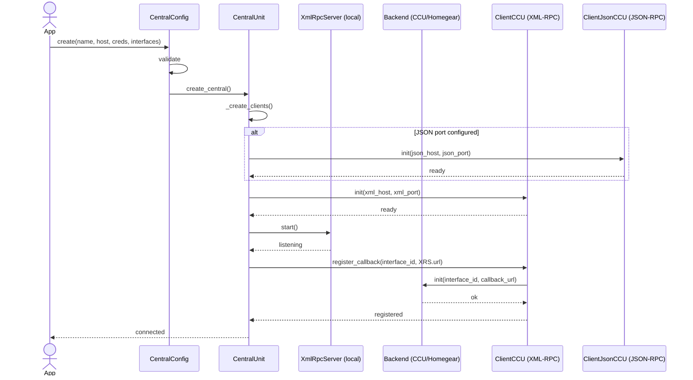
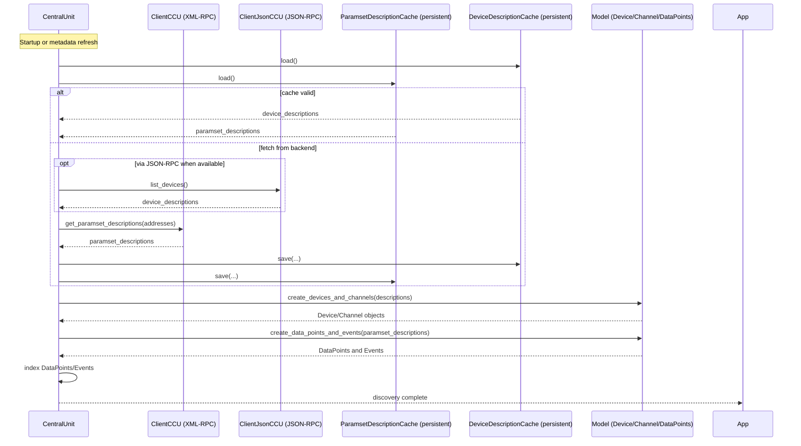
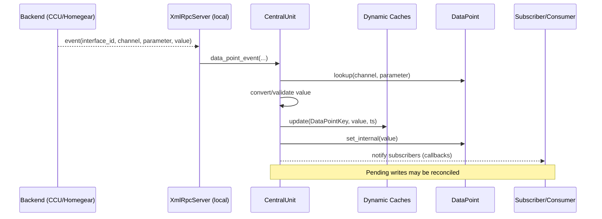

Sequence diagrams: Connect, device discovery, state change propagation

This document provides Mermaid sequence diagrams for key flows in aiohomematic: initial connect, device discovery, and state change propagation.

1. Connect (startup, clients, XML-RPC callback registration)

Notes

- Central starts the local XML-RPC callback server before registering with the backend so the CCU can immediately deliver events.
- When JSON-RPC is enabled, the JSON client is initialized as well; authentication occurs on first use.

2. Device discovery (metadata fetch, model creation)

Notes

- Central prefers cached metadata when fresh; otherwise it fetches from the backend using JSON-RPC where available and XML-RPC for paramset details.
- Model creation is pure: no network I/O, just transformations.

3. State change propagation (event -> caches -> subscribers)

See also

- [for high-level components and responsibilities](docs/architecture.md)
- [for textual data flow and additional sequence diagrams (reads/writes)](docs/data_flow.md)
