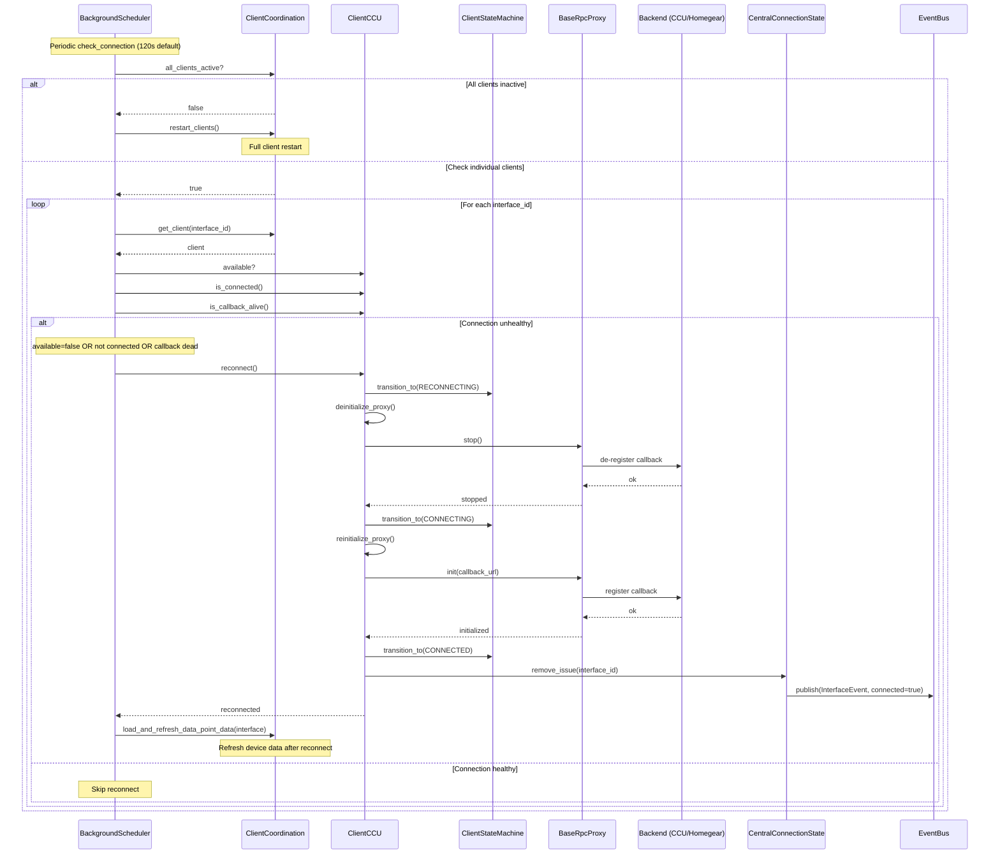

# Sequence diagrams: Connect, device discovery, state change propagation

This document provides Mermaid sequence diagrams for key flows in aiohomematic: initial connect, device discovery, state change propagation, client state machine, and EventBus architecture.

## 1. Connect (startup, clients, XML-RPC callback registration)


### Notes

- Central starts the local XML-RPC callback server before registering with the backend so the CCU can immediately deliver events.
- ClientCoordinator orchestrates client lifecycle: creation, cache loading, initialization, and hub setup.
- Each client uses a ClientStateMachine to enforce valid state transitions (CREATED → INITIALIZING → INITIALIZED → CONNECTING → CONNECTED).
- Handlers are initialized during client creation, providing specialized operations (device ops, firmware, metadata, etc.).

---

## 2. Device discovery (metadata fetch, model creation)


### Notes

- CacheCoordinator manages persistent caches (device descriptions, paramset descriptions) with disk persistence.
- DeviceCoordinator handles device creation with full protocol-based DI (15 protocol interfaces per device).
- Model creation is pure: no network I/O, just transformations from cached descriptions.
- Generic and custom data points are created based on paramset descriptions and device profiles.

---

## 3. State change propagation (event → EventBus → subscribers)


### Notes

- RPCFunctions schedules async tasks via looper to avoid blocking the XML-RPC callback thread.
- EventCoordinator creates typed events (DataPointUpdatedEvent) with DataPointKey for filtering.
- EventBus uses dual-key lookup: specific key (dpk) first, then wildcard (None) fallback.
- Handlers run concurrently via asyncio.gather with error isolation (one failure doesn't affect others).
- Both async and sync handlers are supported transparently.

---

## 4. Client state machine (lifecycle states and transitions)


### State descriptions

| State        | Description                                               |
| ------------ | --------------------------------------------------------- |
| CREATED      | Initial state after client instantiation                  |
| INITIALIZING | Loading metadata, creating proxies, initializing handlers |
| INITIALIZED  | Ready to establish connection to backend                  |
| CONNECTING   | Registering callback with backend via XML-RPC init()      |
| CONNECTED    | Fully operational, receiving events                       |
| DISCONNECTED | Connection lost or intentionally closed                   |
| RECONNECTING | Automatic reconnection attempt in progress                |
| STOPPING     | Graceful shutdown in progress                             |
| STOPPED      | Terminal state, no further transitions                    |
| FAILED       | Error state, allows retry via re-initialization           |

### Notes

- ClientStateMachine enforces valid transitions and raises InvalidStateTransitionError for invalid ones.
- State changes are logged for debugging and can trigger optional callbacks.
- The DISCONNECTED state allows idempotent deinitialize calls (self-transition).
- FAILED state provides recovery paths back to INITIALIZING or CONNECTING.

---

## 5. EventBus architecture (subscription and publishing)


### Event types

| Event                         | Key             | Description                           |
| ----------------------------- | --------------- | ------------------------------------- |
| DataPointUpdatedEvent         | DataPointKey    | Backend data point value update       |
| BackendParameterEvent         | DataPointKey    | Raw parameter event from RPC          |
| BackendSystemEventData        | None            | System events (DEVICES_CREATED, etc.) |
| HomematicEvent                | None            | Homematic events (KEYPRESS, etc.)     |
| SysvarUpdatedEvent            | state_path      | System variable update                |
| InterfaceEvent                | interface_id    | Interface state changes               |
| DeviceUpdatedEvent            | device_address  | Device state update                   |
| FirmwareUpdatedEvent          | device_address  | Firmware info update                  |
| LinkPeerChangedEvent          | channel_address | Channel link changes                  |
| DataPointUpdatedCallbackEvent | unique_id       | External integration notification     |
| DeviceRemovedEvent            | unique_id       | Device/data point removal             |

### Notes

- EventBus is async-first but supports both sync and async handlers transparently.
- Dual-key lookup: specific event.key first, then None (wildcard) fallback.
- Error isolation via return_exceptions=True in asyncio.gather.
- Memory management: clear_subscriptions_by_key() for cleanup when devices are removed.
- Event statistics tracked for debugging via get_event_stats().

---

## 6. Handler architecture (specialized client operations)


### Notes

- ClientCCU delegates operations to specialized handler classes for separation of concerns.
- All handlers extend BaseHandler which provides common dependencies via ClientDependencies protocol.
- Handlers receive protocol interfaces (not direct CentralUnit references) for decoupled architecture.
- Each handler focuses on a specific domain: device ops, firmware, linking, metadata, programs, sysvars, backup.

---

## 7. Client reconnection flow (connection recovery)



### Connection health checks

| Check            | Method                          | Description                           |
| ---------------- | ------------------------------- | ------------------------------------- |
| Client available | `client.available`              | Client not in error state             |
| Proxy connected  | `client.is_connected()`         | Proxy init successful                 |
| Callback alive   | `client.is_callback_alive()`    | Events received within threshold      |
| Ping/Pong        | `check_connection_availability` | Backend responds to ping (if enabled) |

### State transitions during reconnect

```
CONNECTED → RECONNECTING → CONNECTING → CONNECTED
     │                          │
     └──────────────────────────┴───→ FAILED (on permanent error)
```

### Notes

- BackgroundScheduler runs `_check_connection` every 120 seconds (configurable via `RECONNECT_WAIT`).
- Reconnection is attempted for each unhealthy client independently.
- After successful reconnect, device data is refreshed via `load_and_refresh_data_point_data`.
- CentralConnectionState tracks issues and notifies external consumers (Home Assistant) via callbacks.

---

## 8. Cache invalidation strategy


### Cache types and invalidation rules

| Cache                    | Type       | Storage | Invalidation Trigger                         | TTL             |
| ------------------------ | ---------- | ------- | -------------------------------------------- | --------------- |
| DeviceDescriptionCache   | Persistent | Disk    | NEW_DEVICES, DELETE_DEVICES, manual clear    | MAX_CACHE_AGE   |
| ParamsetDescriptionCache | Persistent | Disk    | Device structure change, manual clear        | MAX_CACHE_AGE   |
| CentralDataCache         | Dynamic    | Memory  | Reconnect, periodic refresh, interface clear | MAX_CACHE_AGE/3 |
| DeviceDetailsCache       | Dynamic    | Memory  | Explicit refresh, manual clear               | None (refresh)  |
| CommandCache             | Dynamic    | Memory  | TTL expiry per entry, clear on write confirm | Per-entry TTL   |
| PingPongCache            | Dynamic    | Memory  | Pong received, TTL expiry                    | Per-entry TTL   |
| ParameterVisibilityCache | Computed   | Memory  | Never (static rules)                         | Unbounded       |

### Notes

- **Persistent caches** survive restarts and reduce cold-start time.
- **Dynamic caches** are cleared on connection issues to ensure data freshness.
- **MAX_CACHE_AGE** default is typically 24 hours for persistent caches.
- **ParameterVisibilityCache** is intentionally unbounded (see ADR 0005).
- Backend events (NEW_DEVICES, DELETE_DEVICES) trigger cache invalidation automatically.

---

## 9. Week profile update flow


### Schedule data structure

```python
# Raw CCU format (MASTER paramset)
raw_schedule = {
    "01_WP_WEEKDAY": 127,        # Bitmask: all days
    "01_WP_LEVEL": 0.5,          # Target level (0.0-1.0)
    "01_WP_FIXED_HOUR": 6,       # Start hour
    "01_WP_FIXED_MINUTE": 0,     # Start minute
    "01_WP_ASTRO_TYPE": 0,       # Astro type enum
    "01_WP_CONDITION": 0,        # Condition enum
    # ... more entries for groups 01-10
}

# Structured Python format
schedule_data = {
    1: {
        ScheduleField.WEEKDAY: [Weekday.MONDAY, Weekday.TUESDAY, ...],
        ScheduleField.LEVEL: 0.5,
        ScheduleField.FIXED_HOUR: 6,
        ScheduleField.FIXED_MINUTE: 0,
        ScheduleField.ASTRO_TYPE: AstroType.NONE,
        ScheduleField.CONDITION: ScheduleCondition.NONE,
    },
    2: { ... },
    # ... up to 10 schedule groups
}
```

### Week profile types

| Type               | Device Types             | Schedule Fields                   |
| ------------------ | ------------------------ | --------------------------------- |
| DefaultWeekProfile | Switches, lights, covers | WEEKDAY, LEVEL, TIME, ASTRO, etc. |
| ClimateWeekProfile | Thermostats              | WEEKDAY, TEMPERATURE, TIME, etc.  |

### Notes

- Week profiles are stored in the MASTER paramset of the schedule channel.
- Schedules are cached after loading to avoid repeated backend calls.
- Conversion between raw CCU format and structured Python dicts is bidirectional.
- Setting a schedule triggers a reload to verify the write was successful.
- Schedule entries are identified by pattern `XX_WP_FIELDNAME` where XX is group number (01-10).

---

## See also

- [Architecture](../docs/architecture.md) for high-level components and responsibilities
- [Data flow](../docs/data_flow.md) for textual data flow and additional sequence diagrams (reads/writes)
- [ADR 0005](../docs/adr/0005-unbounded-parameter-visibility-cache.md) for cache strategy rationale
