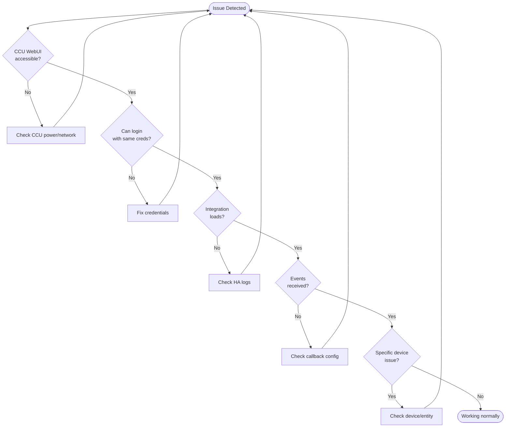

# Troubleshooting

This section helps you diagnose and resolve common issues with aiohomematic and the Homematic(IP) Local integration.

## Quick Diagnostic Flowchart



## Quick Diagnostic Checklist

Before diving into specific issues, verify these basics:

| Check                  | How to Verify             | Expected                           |
| ---------------------- | ------------------------- | ---------------------------------- |
| **CCU Reachable**      | Open CCU WebUI in browser | WebUI loads                        |
| **Credentials Valid**  | Login to CCU WebUI        | Login succeeds                     |
| **Network Ports Open** | `telnet ccu-ip 2010`      | Connection established             |
| **HA Logs Clean**      | Settings → System → Logs  | No errors from `homematicip_local` |
| **Admin Privileges**   | CCU → Settings → Users    | User has admin role                |

## Common Issues by Category

### Connection Problems

- [CCU not reachable](#ccu-not-reachable)
- [Authentication failures](#authentication-failures)
- [Callback/event issues](#callback-issues)
- [Docker networking](#docker-networking)

### Device Issues

- [Device not appearing](#device-not-appearing)
- [Entity shows "unavailable"](#entity-unavailable)
- [Values not updating](#values-not-updating)
- [Button events not working](#button-events-not-working)

### Performance Issues

- [Slow startup](#slow-startup)
- [High CPU usage](#high-cpu-usage)
- [Frequent reconnections](#frequent-reconnections)

---

## Connection Problems

### CCU Not Reachable

**Symptoms:**

- Integration fails to start
- "Connection refused" or "Timeout" errors in logs

**Solutions:**

1. Verify CCU IP address is correct
2. Check if CCU is powered on and fully booted
3. Test connectivity: `ping your-ccu-ip`
4. Verify firewall allows required ports (see [Ports Reference](#ports-reference))

### Authentication Failures

**Symptoms:**

- "Authentication failed" error
- "Invalid credentials" in logs

**Solutions:**

1. Verify username is exactly as shown in CCU (case-sensitive)
2. Check password contains only allowed characters: `A-Z`, `a-z`, `0-9`, `.!$():;#-`
3. Ensure user has administrator privileges in CCU
4. Try logging into CCU WebUI with same credentials

### Callback Issues

**Symptoms:**

- Devices appear but values don't update
- "No events received" warnings
- State changes in CCU not reflected in HA

**Solutions:**

1. Verify CCU can reach Home Assistant (check firewall)
2. For Docker: Set `callback_host` to Docker host IP
3. Check `callback_port_xml_rpc` is not blocked
4. Verify no other integration uses same callback port

### Docker Networking

**Symptoms:**

- Integration works initially but loses connection
- Events not received in Docker environment

**Solutions:**

| Setup                      | Recommendation                                            |
| -------------------------- | --------------------------------------------------------- |
| Docker with bridge network | Set `callback_host` to host IP, configure port forwarding |
| Docker with host network   | Use `network_mode: host` (recommended)                    |
| Home Assistant OS          | Should work out of the box                                |

---

## Device Issues

### Device Not Appearing

**Symptoms:**

- Paired device in CCU but not in HA
- Device visible in CCU but missing from HA devices

**Solutions:**

1. Check **Settings → System → Repairs** for pending device notifications
2. Reload the integration (Settings → Devices & Services → Reload)
3. Verify device is paired in CCU and shows online
4. Check if correct interface is enabled (HmIP-RF, BidCos-RF, etc.)

### Entity Unavailable

**Symptoms:**

- Entity shows "unavailable" state
- Gray entity card in dashboard

**Solutions:**

1. Entity might be disabled by default → Enable in entity settings
2. Check device battery if wireless
3. Verify device is in range of CCU
4. Check RSSI values (see [RSSI Fix](../user/troubleshooting/rssi_fix.md))

### Values Not Updating

**Symptoms:**

- Entity value doesn't change when device state changes
- Manual refresh required to see updates

**Solutions:**

1. Check callback configuration (see [Callback Issues](#callback-issues))
2. For CUxD/CCU-Jack: Enable MQTT for push updates
3. Verify device sends events (some devices only send on significant changes)

### Button Events Not Working

**Symptoms:**

- Button press doesn't trigger automation
- No events in HA developer tools

**Solutions:**

For HomematicIP remotes:

1. Create central links: Use action `homematicip_local.create_central_links`
2. Or activate in CCU: Devices → Click "+" → Channel → Activate

For classic Homematic buttons:

- Should work automatically after pairing

---

## Performance Issues

### Slow Startup

**Symptoms:**

- Integration takes long time to initialize
- Many "Fetching..." messages in logs

**Solutions:**

1. First start after update is slower (cache rebuild) - this is normal
2. Check network latency to CCU
3. Reduce number of enabled interfaces if not all needed
4. Consider disabling system variable/program scan if not used

### High CPU Usage

**Symptoms:**

- Home Assistant CPU spikes related to integration

**Solutions:**

1. Increase system variable scan interval (default 30s, try 60s+)
2. Reduce number of enabled entities
3. Check for rapid value changes causing event floods

### Frequent Reconnections

**Symptoms:**

- "Connection lost" / "Reconnected" messages in logs
- Devices intermittently unavailable

**Solutions:**

1. Check network stability between HA and CCU
2. Verify CCU is not overloaded
3. Check for IP address changes (use static IP or hostname)
4. Review CCU logs for errors

---

## Ports Reference

| Interface        | Purpose                    | Default Port | TLS Port |
| ---------------- | -------------------------- | ------------ | -------- |
| HmIP-RF          | HomematicIP wireless       | 2010         | 42010    |
| BidCos-RF        | Classic Homematic wireless | 2001         | 42001    |
| BidCos-Wired     | Classic Homematic wired    | 2000         | 42000    |
| Virtual Devices  | Heating groups             | 9292         | 49292    |
| JSON-RPC         | Names, rooms, sysvars      | 80           | 443      |
| XML-RPC Callback | Events from CCU to HA      | Configurable | -        |

---

## Getting Debug Information

### Home Assistant Logs

1. Go to **Settings → System → Logs**
2. Filter for `homematicip_local` or `aiohomematic`
3. Enable debug logging if needed:

```yaml
# configuration.yaml
logger:
  default: info
  logs:
    aiohomematic: debug
    custom_components.homematicip_local: debug
```

### Download Diagnostics

1. Go to **Settings → Devices & Services**
2. Find Homematic(IP) Local integration
3. Click the three dots menu → **Download Diagnostics**
4. Attach to bug reports

### Check Integration Version

1. Go to **Settings → Devices & Services**
2. Click on Homematic(IP) Local
3. Version shown at top of page

---

## Further Resources

- [Detailed Troubleshooting Guide](../user/troubleshooting/homeassistant_troubleshooting.md)
- [Troubleshooting Flowchart](../user/troubleshooting/troubleshooting_flowchart.md)
- [RSSI Fix Guide](../user/troubleshooting/rssi_fix.md)
- [CUxD and CCU-Jack](../user/advanced/cuxd_ccu_jack.md)

## Still Need Help?

1. Search [existing issues](https://github.com/sukramj/aiohomematic/issues)
2. Ask in [GitHub Discussions](https://github.com/sukramj/aiohomematic/discussions)
3. Open a new issue with:
   - Home Assistant version
   - Integration version
   - CCU type and firmware version
   - Relevant logs
   - Steps to reproduce
