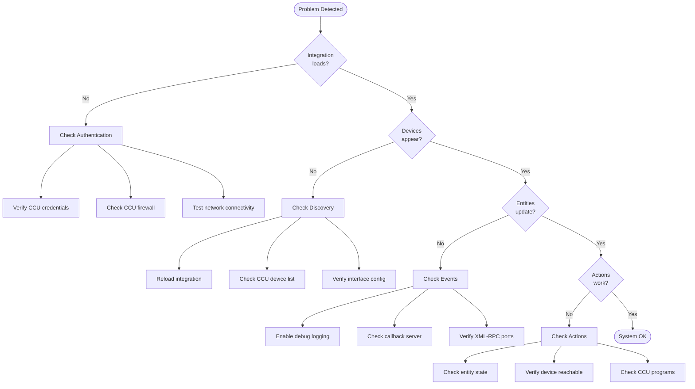
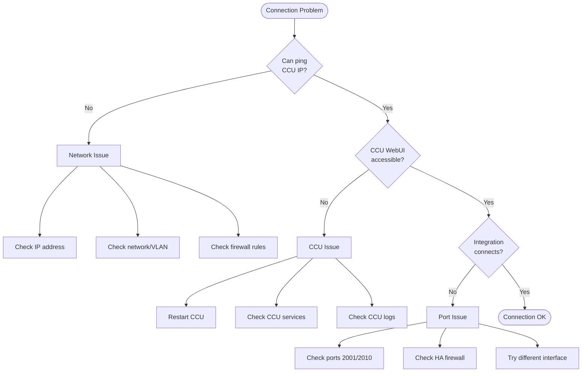
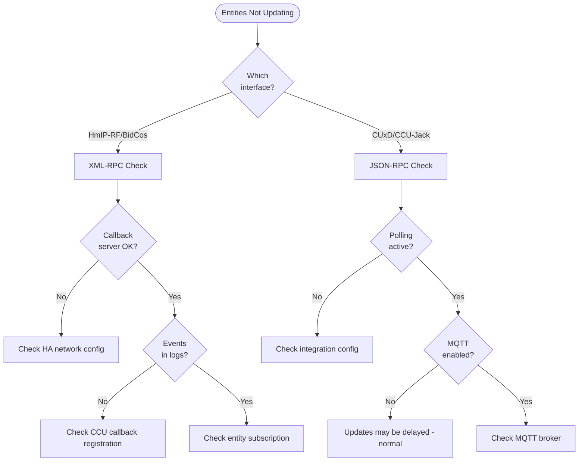
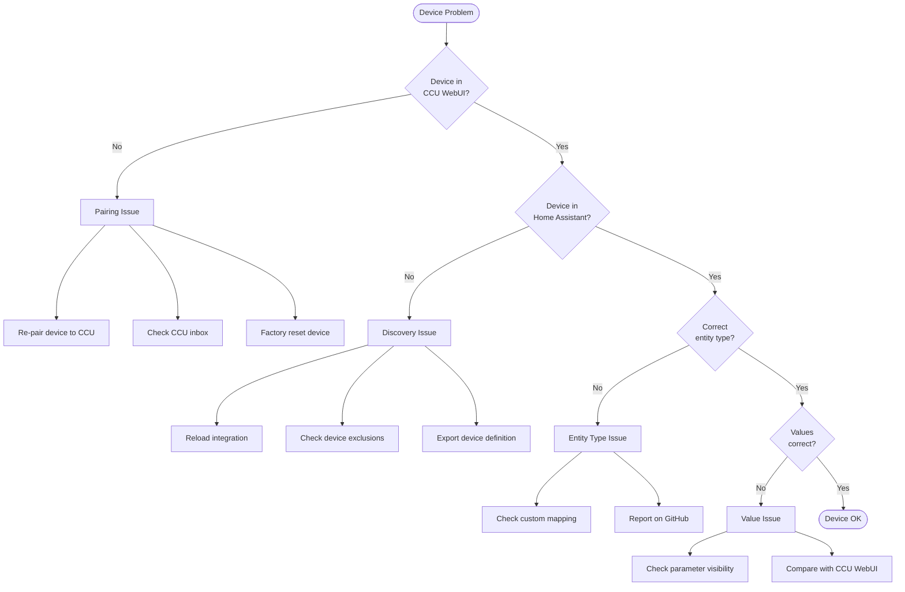

# Troubleshooting Flowchart

Use this visual guide to diagnose and resolve common issues with the Homematic(IP) Local integration.

## Quick Diagnosis



## Connection Issues



## Entity Update Issues



## Device-Specific Issues



## Step-by-Step Diagnosis

### Step 1: Verify Basic Connectivity

1. **Ping the CCU**:

   ```bash
   ping YOUR_CCU_IP
   ```

2. **Access CCU WebUI**: Open `http://YOUR_CCU_IP` in browser

3. **Check HA logs** for connection errors:
   ```yaml
   logger:
     logs:
       aiohomematic: debug
   ```

### Step 2: Check Interface Status

In Home Assistant:

1. Go to **Settings** → **Devices & Services**
2. Click **Homematic(IP) Local** → **Configure**
3. Check interface status (connected/disconnected)

### Step 3: Verify Events Flow

Enable debug logging and look for:

```
# Good - Events arriving
Received event: interface=HmIP-RF channel=XXXX:1 parameter=STATE value=True

# Bad - No events
No events received for 180 seconds
```

### Step 4: Test Actions

Try a simple action in Developer Tools → Services:

```yaml
action: homematicip_local.set_device_value
data:
  device_id: YOUR_DEVICE_ID
  channel: 1
  parameter: STATE
  value: "true"
  value_type: boolean
```

## Common Issues Quick Reference

| Symptom                     | Likely Cause           | Solution                      |
| --------------------------- | ---------------------- | ----------------------------- |
| "Connection refused"        | CCU not reachable      | Check network, firewall       |
| "Authentication failed"     | Wrong credentials      | Verify username/password      |
| Entities show "unavailable" | Connection lost        | Check CCU, reload integration |
| No entity updates           | Callback not working   | Check HA network config       |
| Wrong entity type           | Missing custom mapping | Report on GitHub              |
| CUxD devices slow           | Normal for polling     | Consider MQTT setup           |

## Debug Log Levels

| Level     | What It Shows                  | When to Use           |
| --------- | ------------------------------ | --------------------- |
| `warning` | Errors and warnings            | Normal operation      |
| `info`    | Connection status, events      | Basic troubleshooting |
| `debug`   | All RPC calls, full event data | Detailed diagnosis    |

### Enable Debug Logging

**Easiest method** - Enable via Home Assistant UI:

1. Go to **Settings** → **Devices & Services** → **Homematic(IP) Local**
2. Click **Configure** → **Enable debug logging**
3. Reproduce the problem
4. Click **Disable debug logging** - the debug log will be offered as a file download

**Alternative** - Via YAML configuration:

```yaml
logger:
  default: warning
  logs:
    aiohomematic: debug
    custom_components.homematicip_local: debug
```

## When to Open an Issue

Open a GitHub issue if:

1. **Bug**: Unexpected behavior after following troubleshooting steps
2. **Missing Device Support**: Device works in CCU but not in HA
3. **Wrong Entity Type**: Device creates wrong entity (sensor vs. switch)

**Include in your issue**:

- [ ] Home Assistant version
- [ ] aiohomematic version
- [ ] CCU type and firmware
- [ ] Debug logs (redact sensitive info)
- [ ] Device definition export (for device issues)

### Export Device Definition

```yaml
action: homematicip_local.export_device_definition
data:
  device_id: YOUR_DEVICE_ID
```

## See Also

- [Troubleshooting Guide](../homeassistant_troubleshooting.md) - Detailed troubleshooting
- [CUxD and CCU-Jack](cuxd_ccu_jack.md) - Special interface handling
- [Device Support](device_support.md) - How devices are supported
